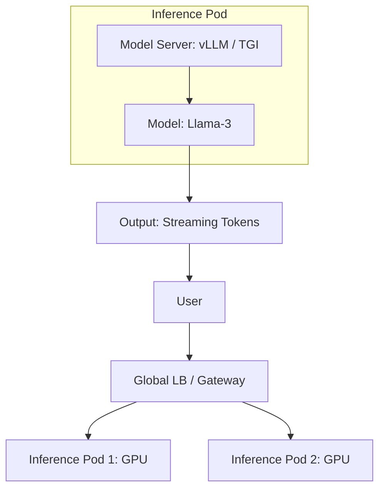

# Model Serving and Inference: From Lab to User

## 1. Beginner-friendly Hinglish Explanation 🇮🇳
Bhai, **Model Serving** ka matlab hai "AI model ko shop par bithana." 

Training mein hum model ko "Sikhate" hain. Serving mein user sawal puchta hai aur model jawab deta hai. Isse "Inference" kehte hain. 
Isme sabse bada panga hai **Latency**. Agar aap ChatGPT se kuch pucho aur wo 10 second baad jawab de, toh aap use use nahi karoge. 
Model Serving mein hum sikhate hain ki: 
- Kaise model ko "Chota" (Compress) karein taaki wo fast chale. 
- Kaise requests ko "Batch" karein taaki GPU busy rahe. 
- Kaise model ko user ke "Pass" (Edge) le jayein.

---

## 2. Deep Technical Explanation
Serving is the phase where a trained model is deployed to handle production traffic.

### Core Challenges
1. **Model Size**: A 70B parameter model is ~140GB. Loading this into VRAM is hard.
2. **Compute Intensity**: Every token generated takes billions of operations.
3. **Throughput vs. Latency**: Serving 1 user at 10ms vs. Serving 100 users at 100ms.

### Optimization Techniques
- **Quantization**: Converting 16-bit weights to 4-bit. Reduces memory by 4x with minimal accuracy loss.
- **Pruning**: Removing "Useless" neurons that don't contribute to the answer.
- **Speculative Decoding**: Using a tiny model to guess the next 5 words, and a big model to "Verify" them in one go. (Saves 2-3x time).
- **KV Caching**: Storing the "Context" of the conversation in memory so the model doesn't have to re-read the whole chat every time.

---

## 3. Architecture Diagrams
**Inference Pipeline with Load Balancing:**

---

## 4. Scalability Considerations
- **Autoscaling on GPU Metrics**: Scaling based on "Request Queue Length" or "GPU Memory," not just CPU.
- **Model Partitioning**: If a model is 200GB and a GPU has 80GB, you must split the model across 3 GPUs (**Pipeline Parallelism**).

---

## 5. Failure Scenarios
- **GPU OOM (Out of Memory)**: Sending a request that is too long (e.g., a whole book) and crashing the GPU. (Fix: **Context Window Limits**).
- **Inference Timeout**: The model taking too long to generate a response for a complex prompt.

---

## 6. Tradeoff Analysis
- **Quality vs. Speed**: 4-bit quantization makes the model faster but slightly "Dumber." 16-bit is smarter but slower.

---

## 7. Reliability Considerations
- **Fallback Models**: If the giant "GPT-4" class model is down, automatically use a smaller "Llama-3" model to answer the user.

---

## 8. Security Implications
- **Prompt Injection**: A user trying to "Hack" the model to say something offensive or leak secret data.
- **PII Leakage**: Ensuring the model doesn't remember a previous user's email address and show it to another user.

---

## 9. Cost Optimization
- **Batching (Continuous Batching)**: Grouping multiple user requests together into one GPU operation. This can increase throughput by 10x!
- **Serverless Inference**: Using services like **AWS SageMaker Serverless** where you only pay per "Token" generated.

---

## 10. Real-world Production Examples
- **Perplexity AI**: Uses highly optimized inference engines to provide real-time search answers.
- **vLLM / Text-Generation-Inference (TGI)**: The standard open-source libraries used to serve LLMs in production.
- **NVIDIA Triton**: A universal model server that can serve PyTorch, TensorFlow, and ONNX models simultaneously.

---

## 11. Debugging Strategies
- **Token-per-second (TPS) Monitoring**: Measuring the "Reading speed" of the AI. (Human reading speed is ~5-10 tokens/sec).
- **Prompt Logs**: Seeing exactly what users are asking (for debugging, not for spying!).

---

## 12. Performance Optimization
- **Flash Attention**: A mathematical optimization that speeds up the most expensive part of a Transformer model by 2-4x.
- **Streaming**: Sending the answer "Word by word" (Server-Sent Events) so the user doesn't have to wait for the whole paragraph to be finished.

---

## 13. Common Mistakes
- **No Rate Limiting**: Letting one user generate 1 million tokens and costing you $10,000.
- **Using Flask for Serving**: Python web servers are too slow for high-concurrency ML. (Use **FastAPI** or specialized C++ servers).

---

## 14. Interview Questions
1. How do you reduce the 'Latency' of an LLM in production?
2. What is 'Quantization' and how does it affect model performance?
3. What is 'Continuous Batching' and why is it important for throughput?

---

## 15. Latest 2026 Architecture Patterns
- **LLM Multiplexing**: Routing a prompt to the "Cheapest and Smallest" model that can answer it correctly (e.g., use a 1B model for "Summarize this" and a 70B model for "Write code").
- **Local-Inference Fallback**: If the user's phone has a good NPU, run the AI locally; otherwise, call the cloud.
- **Model-as-a-Service (MaaS)**: Using APIs like **Groq** (LPUs) that are 10x faster than traditional GPUs for inference.
	
