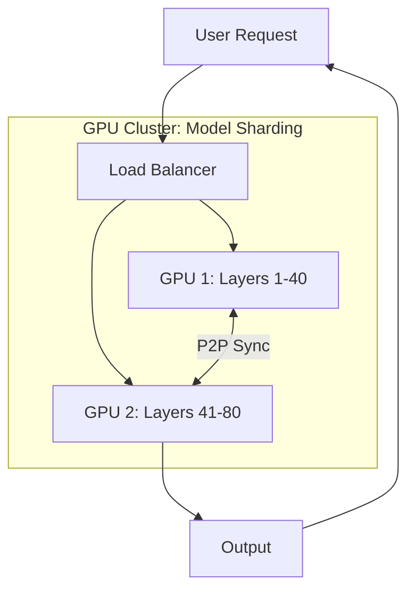

# Scaling AI Workloads: Handling the Global Demand

## 1. Beginner-friendly Hinglish Explanation 🇮🇳
Bhai, **Scaling AI** ka matlab hai "Apne AI ko 'Gully Cricket' se 'IPL' level par le jana." 

Model ko apne laptop par chalana asan hai, par jab 1 crore log ek sath "Video summarize" karne ke liye bolte hain, toh system "Fatt" jata hai. 
Isme do bade scaling problems hote hain: 
1. **GPU Scarcity**: GPUs bohot mehangay aur kam hain. Aapke paas itne GPUs hone chahiye ki line na lage. 
2. **Context Window**: Millions of users ki lambi conversations ko memory mein manage karna. 
Is module mein hum sikhate hain ki kaise **Distributed Inference** aur **Smart Cache** use karke hum pure duniya ko AI serve kar sakte hain.

---

## 2. Deep Technical Explanation
Scaling AI workloads involves managing massive compute and memory requirements while maintaining low latency and high throughput.

### Scaling Strategies
- **Replica Scaling**: Running 100s of identical copies of a model across multiple GPUs and load balancing requests.
- **Model Sharding (Sharded Inference)**: Splitting a single model (like a 400B parameter Llama-3) across multiple GPUs because it won't fit on one.
- **Speculative Execution**: Running multiple possible "Next tokens" in parallel to find the answer faster.

### The Memory Bottleneck (VRAM)
Unlike normal apps, AI is limited by **GPU VRAM** (Video RAM). If you run out of VRAM, the system crashes. 
- **PagedAttention (vLLM)**: A revolutionary way to manage memory (like virtual memory in an OS) to allow 5x more users on the same GPU.

---

## 3. Architecture Diagrams
**Distributed Inference with Sharding:**

---

## 4. Scalability Considerations
- **Inter-GPU Bandwidth**: When sharding a model, the speed of the "Wire" between GPUs (NVLink) becomes the biggest bottleneck.
- **Cold vs Warm Scaling**: Keeping "Hot" GPUs ready to handle spikes, as booting a GPU server takes 5-10 minutes.

---

## 5. Failure Scenarios
- **Thundering Herd**: Millions of users asking for "The latest news" at the same time, causing every GPU to try and load the same context simultaneously.
- **Token Overflow**: A user sending a prompt that exceeds the "Context Window," causing the model to lose track of the beginning of the conversation.

---

## 6. Tradeoff Analysis
- **Throughput vs. Latency**: Grouping 64 users together (Batching) makes the GPU more efficient but makes each individual user wait longer for their first word.

---

## 7. Reliability Considerations
- **Graceful Degradation**: If the cluster is 90% full, automatically switch users to a smaller, faster model (e.g., switch from GPT-4 to GPT-3.5) to keep the system running.

---

## 8. Security Implications
- **Resource Exhaustion Attack**: An attacker sending very complex "Math" prompts to keep the GPU busy for 60 seconds, blocking other users.

---

## 9. Cost Optimization
- **Fractional GPUs**: Using technology (like **NVIDIA MIG**) to split one powerful GPU into 7 smaller "Virtual GPUs" for tiny tasks.
- **Inference-optimized Chips**: Using specialized chips (ASICs) like **AWS Inferentia** or **Groq** which are 10x cheaper than standard NVIDIA GPUs for serving.

---

## 10. Real-world Production Examples
- **ChatGPT**: Uses thousands of A100/H100 GPUs and custom PagedAttention-like memory management to serve 100M+ users.
- **Midjourney**: Uses massive GPU clusters to generate images in parallel for millions of artists.
- **Pinterest**: Uses distributed inference to categorize 10,000+ images per second.

---

## 11. Debugging Strategies
- **VRAM Profiling**: Seeing which "Layers" of the model are eating the most memory.
- **Queue Lag Monitoring**: Tracking how many seconds a request sits in line before it hits a GPU.

---

## 12. Performance Optimization
- **Quantization (AWQ / GPTQ)**: 4-bit quantization allows you to fit a "Large" model on a "Cheap" GPU.
- **Flash Attention 2**: The current state-of-the-art for making transformers faster on modern hardware.

---

## 13. Common Mistakes
- **Scaling on CPU usage**: AI is GPU-bound. Scaling based on CPU usage is like trying to check a car's engine by looking at its tires.
- **No Prompt Caching**: Re-calculating the "System Prompt" (which is the same for every user) every single time.

---

## 14. Interview Questions
1. How do you handle 'Memory Fragmentation' in GPU VRAM?
2. What is 'Model Sharding' and when is it necessary?
3. How would you design an autoscaling system for a fleet of 500 GPUs?

---

## 15. Latest 2026 Architecture Patterns
- **LPU (Language Processing Units)**: Moving away from GPUs to LPUs (like **Groq**) that are designed specifically for sequential token generation.
- **Router-of-Models**: A system that automatically routes a request to a local phone AI, a small cloud AI, or a giant cloud AI based on complexity and cost.
- **Infinite Context**: Systems that use "Streaming Memory" to allow AI to process a 10-million-word document without crashing the GPU.
	
