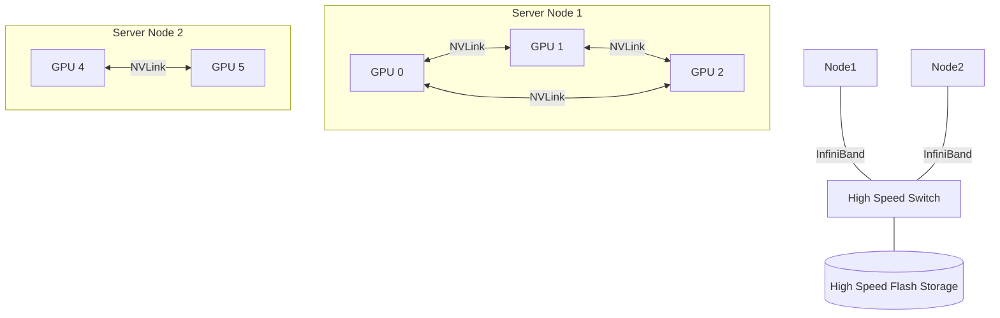

# Training Infrastructure and GPUs: The Engine Room of AI

## 1. Beginner-friendly Hinglish Explanation 🇮🇳
Bhai, **Training Infrastructure** ka matlab hai wo "Factory" jahan AI model banta hai. 

Socho aapko ek bachhe ko poori library padhani hai. Aap use ek ek kitab doge toh saalon lag jayenge. Isliye aap 1000 teachers (GPUs) lagate ho jo library ke alag-alag hisse ek sath bachhe ko sikhate hain. 
- **GPU (Graphics Processing Unit)**: Ye normal processor (CPU) se alag hai kyunki ye ek sath hazaron "Choti maths" (Matrix multiplication) kar sakta hai. 
- **Clusters**: Hazaron GPUs ko ek sath jodna taaki wo ek "Supercomputer" ki tarah kaam karein. 
Bina is infrastructure ke, ChatGPT jaise models ko train karne mein 100 saal lag jate.

---

## 2. Deep Technical Explanation
Large-scale AI training requires specialized hardware and high-performance networking to handle trillions of floating-point operations.

### Why GPUs?
CPUs are designed for complex branching logic (if/else). GPUs are designed for SIMD (Single Instruction, Multiple Data). Since deep learning is just billions of matrix multiplications, GPUs are 100x-1000x faster.

### Key Hardware Components
1. **NVIDIA H100 / B200**: The gold standard for AI chips.
2. **NVLink**: A high-speed bridge between GPUs on the same server (up to 900GB/s).
3. **InfiniBand / RoCE**: Ultra-low latency networking to connect different servers in a cluster.
4. **HBM (High Bandwidth Memory)**: Specialized RAM on the GPU that is incredibly fast.

### Training Paradigms
- **Data Parallel**: Divide data, replicate model.
- **Pipeline Parallel**: Divide layers across GPUs.
- **Tensor Parallel**: Divide a single layer's math across multiple GPUs.

---

## 3. Architecture Diagrams
**GPU Training Cluster:**

---

## 4. Scalability Considerations
- **Communication Overhead**: As you add more GPUs, they spend more time "Talking" to each other (syncing weights) and less time "Thinking." (Fix: **Gradient Accumulation**).
- **Check-pointing**: In a 10,000 GPU cluster, one GPU fails every few hours. You must save the model state every 30 mins to avoid losing all progress.

---

## 5. Failure Scenarios
- **Thermal Throttling**: The GPUs get too hot and slow down. (Fix: **Liquid Cooling**).
- **Network Congestion**: A slow switch slows down the entire cluster.

---

## 6. Tradeoff Analysis
- **Cloud vs. On-Premise**: Renting GPUs (AWS/Azure) is flexible but 3x more expensive for long-term training than buying your own H100s.

---

## 7. Reliability Considerations
- **NCCL (NVIDIA Collective Communications Library)**: Specialized software that handles the complex "Gossip" between GPUs to ensure they stay in sync perfectly.

---

## 8. Security Implications
- **Model Poisoning**: If someone hacks into your training cluster, they can subtly change the model weights to include a "Backdoor."

---

## 9. Cost Optimization
- **FP8 / FP16 Training**: Using "Less precise" numbers (Half-precision) to train twice as fast with half the memory, without losing model quality.

---

## 10. Real-world Production Examples
- **Meta (Llama 3)**: Trained on a cluster of 24,000+ NVIDIA H100 GPUs.
- **Microsoft / OpenAI (Stargate)**: Planning a $100 billion supercomputer with millions of GPUs.
- **Google (TPU)**: Google built their own chips (Tensor Processing Units) specifically for AI, bypassing NVIDIA entirely.

---

## 11. Debugging Strategies
- **GPU Profilers (Nsight)**: Seeing if the GPU is "Starving" (waiting for data) or if it's actually working at 100%.
- **All-Reduce Logs**: Monitoring the speed of weight synchronization.

---

## 12. Performance Optimization
- **Zero Redundancy Optimizer (ZeRO)**: A technique by Microsoft to reduce memory usage by 8x, allowing bigger models to fit on the same GPUs.

---

## 13. Common Mistakes
- **Bottlenecked by Disk**: Using a slow HDD to read training data. The GPU will be 99% idle waiting for the disk. (Use **Fast NVMe Storage**).
- **Ignoring Egress Costs**: Trying to train on AWS using data stored in Google Cloud. (The transfer bill will be huge!).

---

## 14. Interview Questions
1. Why are GPUs better than CPUs for Deep Learning?
2. What is the difference between 'Data Parallelism' and 'Model Parallelism'?
3. What is 'InfiniBand' and why is it used in AI clusters?

---

## 15. Latest 2026 Architecture Patterns
- **Blackwell Architecture**: NVIDIA's 2026 chips that are 30x faster for inference and 4x faster for training than previous generations.
- **Optical Interconnects**: Using "Light" instead of "Copper wires" to connect GPUs, reducing latency by 10x.
- **Sovereign AI Clusters**: Countries (like UAE/France) building their own national GPU clusters to avoid dependence on Silicon Valley.
	
