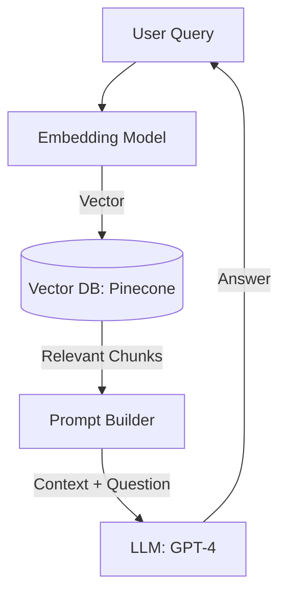

# Vector Databases and RAG: The AI's Long-term Memory

## 1. Beginner-friendly Hinglish Explanation 🇮🇳
Bhai, **Vector Database** aur **RAG (Retrieval-Augmented Generation)** modern AI ki "Yaaddasht" (Memory) hain. 

Normal databases "Exact match" search karte hain (E.g., `WHERE name='Rahul'`). AI model ko numbers (Vectors) chahiye hote hain. 
- **Embeddings**: AI text ya image ko ek lambi list of numbers (Vector) mein badal deta hai jo uska "Meaning" represent karta hai. 
- **Vector DB**: In numbers ko store karta hai taaki hum "Similar" cheezein dhund sakein (E.g., "Mera kuta bimar hai" -> Vector DB dhoondhega "Veterinary doctors near me"). 
- **RAG**: Jab aap ChatGPT se apne private data (Jaise company ki PDF) par sawal puchte ho, toh RAG pehle DB se sahi "Information" nikalta hai aur phir use AI ko deta hai answer banane ke liye.

---

## 2. Deep Technical Explanation
RAG is a framework for retrieving data from an external knowledge base to ground Large Language Models (LLMs) in specific, up-to-date, or private information.

### The Pipeline
1. **Indexing**: 
    - Split documents into "Chunks."
    - Convert chunks into "Embeddings" using an Embedding Model (e.g., `text-embedding-3-small`).
    - Store in a **Vector Database**.
2. **Retrieval**: 
    - Convert user query into a vector.
    - Perform a "Nearest Neighbor" (ANN) search in the DB.
3. **Generation**: 
    - Take the top-K retrieved chunks and put them in the LLM's prompt.
    - Ask the LLM to answer the question based *only* on that context.

---

## 3. Architecture Diagrams
**RAG Workflow:**

---

## 4. Scalability Considerations
- **Indexing Latency**: Adding millions of new documents per hour while keeping search fast. (Fix: **HNSW - Hierarchical Navigable Small World** algorithm).
- **Context Window**: How much "Context" can you fit in the LLM? Modern LLMs handle 128k+ tokens, but bigger context = more cost and latency.

---

## 5. Failure Scenarios
- **Hallucination**: The DB returns irrelevant data, and the AI makes up a confident but wrong answer. (Fix: **Citation checking**).
- **Lost in the Middle**: LLMs often ignore information in the middle of a long context. (Fix: **Better chunking and re-ranking**).

---

## 6. Tradeoff Analysis
- **Chunk Size**: Small chunks (Better precision) vs. Large chunks (Better context).
- **Vector DB choice**: Managed (Pinecone) vs. Self-hosted (Milvus/Weaviate) vs. Local (Chroma/FAISS).

---

## 7. Reliability Considerations
- **Semantic Cache**: If two users ask the same question, don't call the LLM again; just return the previous answer from a cache based on "Vector Similarity."

---

## 8. Security Implications
- **Data Privacy**: Ensuring that an employee cannot see "Salary data" in the RAG system if they don't have permission in the original database.
- **Prompt Injection via Retrieval**: Attacker putting malicious text in a document that, when retrieved, tricks the AI.

---

## 9. Cost Optimization
- **Embedding Costs**: Using small, open-source embedding models instead of calling OpenAI's API for every chunk.
- **Reranking**: Using a cheap model for retrieval and an expensive model (Cross-encoder) only for the top 5 results.

---

## 10. Real-world Production Examples
- **Notion AI**: Uses RAG to answer questions based on your personal notes.
- **Morgan Stanley**: Built a RAG system for their 100,000+ internal research reports to help financial advisors.
- **Klang**: A specialized RAG engine for legal and medical compliance.

---

## 11. Debugging Strategies
- **TruLens / Ragas**: Specialized tools to measure the "Faithfulness" (Is the answer supported by the data?) and "Relevance" of your RAG system.
- **Retrieval Visualization**: Seeing which chunks were selected for a specific query.

---

## 12. Performance Optimization
- **Hybrid Search**: Combining Vector search (for meaning) with Keyword search (for exact terms like "Part number 123-X").
- **HNSW Indexing**: A graph-based indexing method that makes vector search $O(\log N)$.

---

## 13. Common Mistakes
- **Poor Chunking**: Splitting a sentence in half, losing its meaning. (Use **Recursive Character Splitting**).
- **No Evaluation**: Building a RAG system and assuming it works without testing it on thousands of questions.

---

## 14. Interview Questions
1. How does the RAG (Retrieval-Augmented Generation) pipeline work?
2. What is an 'Embedding' and how is it different from 'Tokenization'?
3. Compare 'HNSW' and 'IVF' indexing in Vector Databases.

---

## 15. Latest 2026 Architecture Patterns
- **Long-Context RAG**: Moving away from chunking and just giving the LLM the whole 1-million-token book directly (using **Gemini 1.5**).
- **Agentic RAG**: An AI agent that "Decides" which database to search, "Filters" the results, and "Asks follow-up questions" if the info is missing.
- **GraphRAG**: Combining Knowledge Graphs with Vector DBs to understand complex relationships between entities (e.g., "How is person A connected to Company B?").
	
