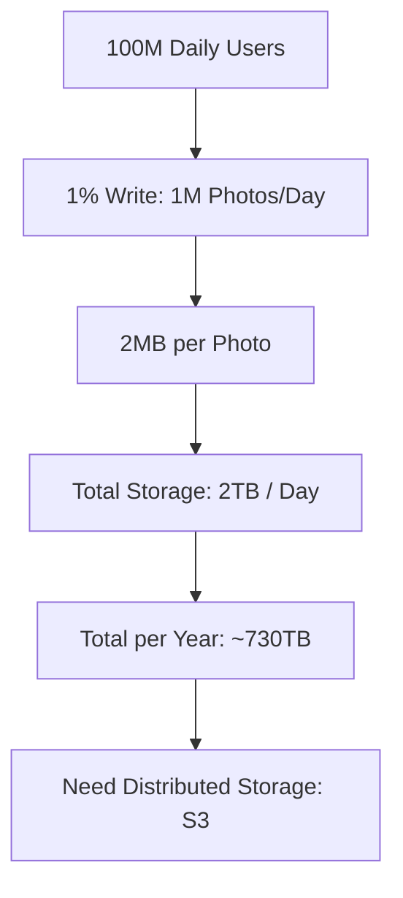

# Back-of-the-Envelope Estimation: The Math of Scale

## 1. Beginner-friendly Hinglish Explanation 🇮🇳
Bhai, **Back-of-the-envelope Estimation** ka matlab hai "Moti-moti calculation" (Rough math). 

Interviewer aapko calculator nahi dega, aur na hi use "Exact" number chahiye. Wo ye dekh raha hai ki aapko "Scale" ka andaza hai ya nahi. 
- "Agar 10 crore log hain aur har koi 1 photo upload karta hai (2MB), toh humein kitni storage chahiye?" 
- `10^8 * 2 * 10^6 = 2 * 10^14 = 200 Terabytes`. 
Ye math aapko ye batane mein madad karti hai ki: "Humein 1 server chahiye ya 100?" Isse aapki architecture "Hawa mein" nahi, "Data par" based hoti hai.

---

## 2. Deep Technical Explanation
Estimation helps determine the scale of the system and guides hardware/software choices.

### The Powers of 2 (Cheat Sheet)
- $2^{10} \approx 1,000$ (Thousand / Kilo)
- $2^{20} \approx 1,000,000$ (Million / Mega)
- $2^{30} \approx 1,000,000,000$ (Billion / Giga)

### Latency Numbers You Should Know
- **L1 Cache reference**: 0.5 ns
- **Main memory (RAM) reference**: 100 ns
- **Read 1MB sequentially from SSD**: 1,000,000 ns (1 ms)
- **Round trip within same data center**: 500,000 ns (0.5 ms)
- **Round trip NYC to London**: 150,000,000 ns (150 ms)

### Throughput Calculation
- **QPS (Queries Per Second)**: `Daily Active Users * Average requests per user / 86,400 (seconds in a day)`.
- **Tip**: Round 86,400 up to **100,000** for easier mental math during interviews!

---

## 3. Architecture Diagrams
**Storage Calculation Workflow:**

---

## 4. Scalability Considerations
- **Peak Traffic**: Always assume peak traffic is **2x to 5x** the average traffic. (E.g., if average is 10k QPS, design for 50k QPS).

---

## 5. Failure Scenarios
- **Underestimating Storage**: Forgetting about "Replication." If you have 2TB of data and 3 replicas, you actually need 6TB of storage!

---

## 6. Tradeoff Analysis
- **RAM vs. Disk**: "We have 1TB of active data. We can't put it all in RAM (too expensive), so we will use SSDs and cache only the top 10% in Redis."

---

## 7. Reliability Considerations
- **Bandwidth**: If you are streaming video, calculate if a standard 10Gbps network card can handle the traffic or if you need multiple cards.

---

## 8. Security Implications
- **Log Storage**: Estimating how much disk space you need just to store the "Security Audit Logs" for 1 year.

---

## 9. Cost Optimization
- **Tiered Storage**: "90% of our data is 'Cold' (older than 1 month). We will move it to AWS Glacier to save 90% on costs."

---

## 10. Real-world Production Examples
- **Google's 'Jeff Dean Numbers'**: The original set of latency numbers that every engineer at Google must know.
- **Twitter's 'Celebrity' Problem**: Estimating how many servers are needed just to handle a tweet from Justin Bieber (millions of deliveries in seconds).

---

## 11. Debugging Strategies
- **Sanity Check**: If your math says you need 1 million servers for a simple chat app, your math is wrong! Re-check your zeros.

---

## 12. Performance Optimization
- **Read/Write Ratio**: Knowing if the system is **Read-heavy** (100:1) or **Write-heavy** (1:1) tells you whether to focus on Caching or Sharding.

---

## 13. Common Mistakes
- **Forgetting the Units**: Confusing Bits (b) with Bytes (B). (1 Byte = 8 Bits).
- **Ignoring the Seconds in a Day**: Not knowing that there are ~86,400 seconds in a day.

---

## 14. Interview Questions
1. How many servers do you need for 100k QPS if one server can handle 1k QPS?
2. Estimate the bandwidth required for a video streaming service with 1M concurrent users.
3. Why do we assume peak traffic is 2x-5x the average?

---

## 15. Latest 2026 Architecture Patterns
- **AI Token Estimation**: Calculating the cost and latency of an LLM call: `Tokens in + Tokens out * Cost per 1k tokens`.
- **Vector Storage Math**: Estimating the RAM needed for a 1536-dimensional vector index with 100 million entries.
- **Energy-Efficiency Math**: Calculating the "Carbon cost" of a specific architecture based on its GPU/CPU usage.
	
