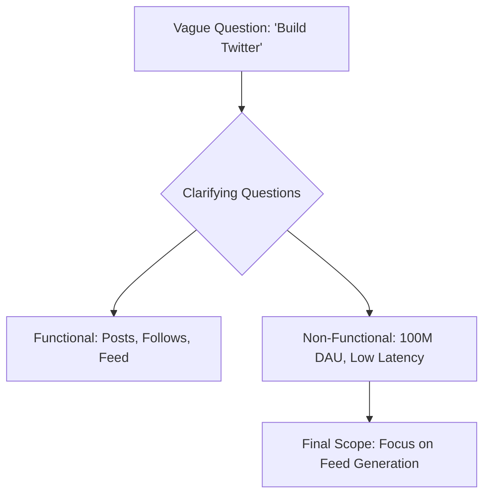

# Clarifying Questions and Requirements: Setting the Stage

## 1. Beginner-friendly Hinglish Explanation 🇮🇳
Bhai, system design interview ka pehla 5 minute sabse important hai. 

Interviewer jaan-boojh kar aapko ek "Aadha" (Incomplete) sawal dega, jaise: "Ek WhatsApp banao." 
Agar aapne turant diagram banana shuru kar diya, toh aap fail ho! Kyun? 
- WhatsApp for 100 people or 1 billion? 
- Sirf text messages ya video calls bhi? 
- Group chats chahiye ya nahi? 
**Clarifying Questions** puchna ye dikhata hai ki aap ek "Matlabi" (Purposeful) engineer ho jo bina soche samjhe kaam shuru nahi karta.

---

## 2. Deep Technical Explanation
Defining requirements is the foundation of a successful design.

### Functional Requirements (Features)
- What will the user do? (E.g., "User can post tweets," "User can follow others").
- What are the core use cases?

### Non-Functional Requirements (Performance/Scale)
- **Scalability**: How many DAU (Daily Active Users)? What is the peak traffic?
- **Availability**: Is it okay if the system is down for 5 mins? (99.9% vs 99.999%).
- **Latency**: How fast should the response be? (E.g., < 200ms).
- **Consistency**: Is it okay if a user sees a "Like" 2 seconds late? (Eventual vs Strong Consistency).

---

## 3. Architecture Diagrams
**The Requirement Funnel:**

---

## 4. Scalability Considerations
- **Growth Estimate**: "We are starting with 1M users, but we should design for 10M in the next year."

---

## 5. Failure Scenarios
- **The 'Assumption' Trap**: Assuming the interviewer wants a "Global" system when they actually only care about a "Local" one. **Never Assume, Always Ask.**

---

## 6. Tradeoff Analysis
- **Features vs. Complexity**: "If we want to support Video Calls, the complexity will increase 10x. Should we focus on Text first for this interview?"

---

## 7. Reliability Considerations
- **Data Durability**: Asking "Is it okay if we lose a message in a 0.001% chance event?".

---

## 8. Security Implications
- **Privacy Level**: "Do we need end-to-end encryption or is standard server-side encryption enough?".

---

## 9. Cost Optimization
- **Scale-to-Cost**: "At 1B users, storing every message forever will be very expensive. Do we have a data retention policy?".

---

## 10. Real-world Production Examples
- **Google's 'Product Requirements Document' (PRD)**: A formal version of this step used in real engineering projects.
- **RFC (Request for Comments)**: How engineers at large companies (like Stripe) agree on requirements before writing code.

---

## 11. Debugging Strategies
- **Conflict Resolution**: If the interviewer says "I want 100% Availability AND 100% Consistency," remind them of the **CAP Theorem**!

---

## 12. Performance Optimization
- **Setting Targets**: "We will aim for p99 latency of < 500ms for the home feed."

---

## 13. Common Mistakes
- **Not asking about Scale**: Building a system for 10 users and then being told it needs to handle 10 million.
- **Accepting 'Everything'**: Trying to build every feature in 45 minutes. (Pick the top 2-3!).

---

## 14. Interview Questions
1. Why should you ask about 'Daily Active Users (DAU)' at the start?
2. What are 'Non-Functional Requirements'? Give 3 examples.
3. How do you handle an interviewer who is being very vague?

---

## 15. Latest 2026 Architecture Patterns
- **AI-Powered Requirement Drafting**: Using an AI agent to help brainstorm all potential edge cases of a requirement.
- **Sustainability Requirements**: 2026 standard—asking about the "Carbon footprint" or "Energy efficiency" of the design.
- **Regulatory Compliance (GDPR/EU AI Act)**: Asking if the data must stay within a specific geographic boundary from the start.
	
