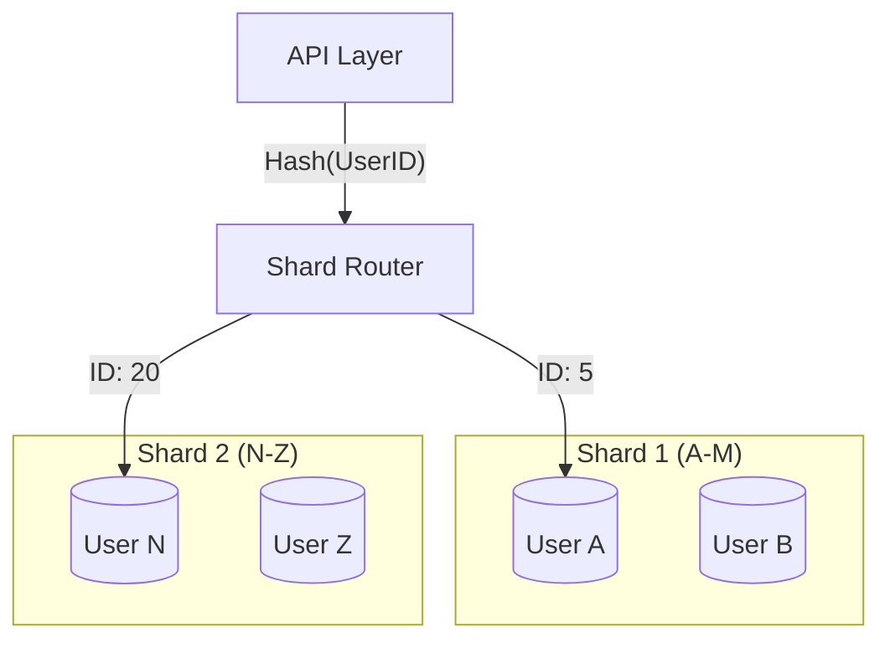

# Deep Dive into Components: The Engineering Details

## 1. Beginner-friendly Hinglish Explanation 🇮🇳
Bhai, **Deep Dive** ka matlab hai "Post-mortem karna." 

Interview ke high-level design ke baad, interviewer ek box pakad lega aur kahega: "Chalo, is database ke baare mein baat karte hain." 
- "Aap sharding kaise karoge?" 
- "Kaunsa Index use karoge?" 
- "Jab network delay hoga tab kya hoga?" 
Ye wo time hai jahan aapko apni "Engineering Depth" dikhani hoti hai. Aapko boxes ke "Andar" kya ho raha hai, wo batana hota hai.

---

## 2. Deep Technical Explanation
The deep dive is where you justify your architectural choices with data, math, and specific technology knowledge.

### Common Deep Dive Topics
1. **Database Sharding**: How do you pick a shard key? (User ID? Geography? Hash?).
2. **Cache Invalidation**: How do you ensure the cache isn't showing "Old" data? (Write-through vs. Cache-aside).
3. **Consistent Hashing**: How do you add/remove servers without moving all the data?
4. **Consensus Algorithms**: How do nodes agree on who is the leader? (Paxos/Raft).
5. **Message Ordering**: In Kafka, how do you ensure Message 1 is processed before Message 2? (Partitioning).

---

## 3. Architecture Diagrams
**Sharding Deep Dive:**

---

## 4. Scalability Considerations
- **Hot Keys**: What if "Justin Bieber" is on Shard 1? Everyone will query that one shard and it will crash. (Fix: **Secondary Sharding** or **Aggressive Caching**).

---

## 5. Failure Scenarios
- **Replication Lag**: A user writes a comment, refreshes the page, but can't see it because the "Read" went to a slow replica. (Fix: **Read-your-writes consistency**).

---

## 6. Tradeoff Analysis
- **LSM-Tree vs. B-Tree**: "I used an LSM-tree based database (Cassandra) because our app is write-heavy, and LSM-trees are much faster for writes than B-trees."

---

## 7. Reliability Considerations
- **Quorum Reads/Writes**: Requiring a majority of nodes to confirm a write before telling the user "Success."

---

## 8. Security Implications
- **Data Masking**: Ensuring that sensitive fields (like Credit Card numbers) are masked or encrypted before they are stored in the database.

---

## 9. Cost Optimization
- **Compression Algorithms**: Using **Snappy** or **Gzip** in your message queue to reduce bandwidth costs.

---

## 10. Real-world Production Examples
- **GitHub's MySQL Sharding**: They use a tool called **Vitess** to manage thousands of database shards at scale.
- **Discord's Move to ScyllaDB**: Why they moved trillions of messages from Cassandra to ScyllaDB for better performance.

---

## 11. Debugging Strategies
- **Slow Query Logs**: How to find the specific SQL query that is slowing down the entire system.
- **Cache Hit Ratio**: Monitoring what percentage of requests are being served from Redis vs. the Database.

---

## 12. Performance Optimization
- **Bloom Filters**: Using a tiny bit of memory to avoid "Impossible" database queries.
- **Zero-Copy**: How Kafka sends data from the disk directly to the network without touching the CPU.

---

## 13. Common Mistakes
- **Vague Answers**: "I will use a cache." (Interviewer: "Which one? Why? How will you handle invalidation?").
- **Ignoring Edge Cases**: Not thinking about what happens when the network between the server and the database is slow.

---

## 14. Interview Questions
1. How do you handle 'Hot Shards' in a distributed database?
2. Compare 'Write-Through' and 'Write-Behind' caching strategies.
3. How does the 'Raft' consensus algorithm work in simple terms?

---

## 15. Latest 2026 Architecture Patterns
- **Storage-Compute Separation**: Using systems like **Snowflake** or **Neon** where the CPU and the Disk can scale independently.
- **eBPF-based Observability**: Using low-level kernel tracing to see exactly why a component is slow without adding any overhead.
- **WebAssembly (Wasm) in the DB**: Running custom code inside the database for ultra-fast processing (Edge DBs).
	
