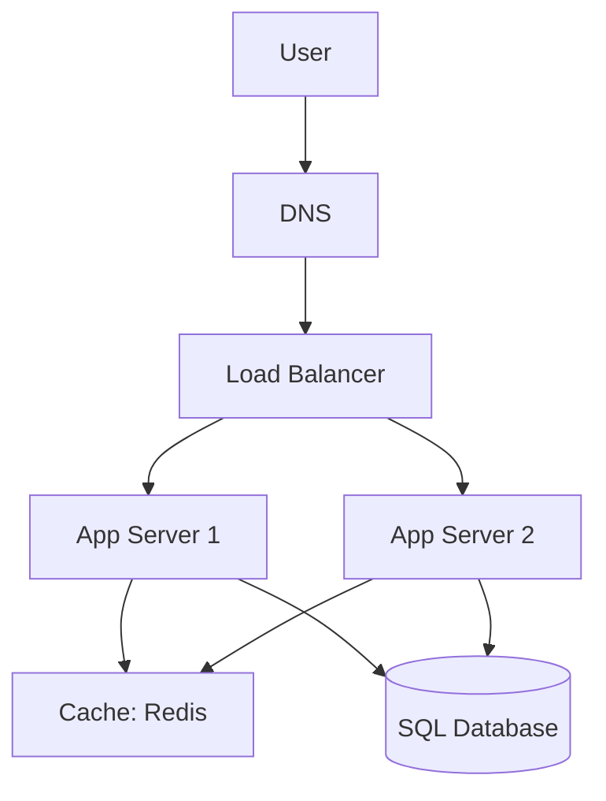

# High-Level Design (HLD) Basics: The Big Picture

## 1. Beginner-friendly Hinglish Explanation 🇮🇳
Bhai, **High-Level Design (HLD)** ka matlab hai "Makaan ka naksha (Blueprint) banana." 

Abhi hum ye nahi dekh rahe ki deewar mein kaunsi eenth (brick) lagegi. Hum sirf ye dekh rahe hain ki: 
- Kitchen kahan hoga? (Service A) 
- Bedroom kahan hoga? (Service B) 
- Aur unke beech mein raasta kahan hai? (API/Network). 
HLD mein hum "System Components" ko boxes ki tarah draw karte hain aur unhe "Load Balancer" aur "Database" se jodte hain. Ye interview ka wo part hai jahan aap apna "Core Logic" samjhate ho.

---

## 2. Deep Technical Explanation
HLD describes the overarching architecture of the system and how various components interact.

### Core Components of every HLD
1. **Client**: Browser, Mobile App, or IoT device.
2. **DNS**: Translates domain name to IP address.
3. **Load Balancer**: Distributes incoming traffic across multiple servers.
4. **API Gateway**: Single entry point for all requests; handles Auth, SSL termination, Rate limiting.
5. **Application Servers**: Where the business logic lives.
6. **Database**: Persistent storage (SQL or NoSQL).
7. **Cache**: Fast, temporary storage for frequent data (Redis).

### Request Flow
- **Step 1**: User sends request.
- **Step 2**: Load Balancer picks a healthy server.
- **Step 3**: Server checks Cache. If miss, it queries DB.
- **Step 4**: Server returns response.

---

## 3. Architecture Diagrams
**A Standard High-Level Architecture:**

---

## 4. Scalability Considerations
- **Vertical vs. Horizontal**: Always assume we will scale horizontally (adding more servers) in the HLD.
- **Statelessness**: Ensure app servers don't store "User state" (like sessions) in local RAM, so the Load Balancer can send any user to any server.

---

## 5. Failure Scenarios
- **DB Failure**: What happens if the only database dies? (Fix: **Replication / Master-Slave**).
- **LB Failure**: What happens if the Load Balancer dies? (Fix: **Active-Passive LB setup**).

---

## 6. Tradeoff Analysis
- **Monolith vs. Microservices**: "For this HLD, we will use Microservices because different teams need to work on 'Payments' and 'Search' independently."

---

## 7. Reliability Considerations
- **Health Checks**: The Load Balancer should constantly "Ping" the app servers to ensure they are alive before sending traffic.

---

## 8. Security Implications
- **HTTPS/TLS**: Every arrow in the HLD should be considered an encrypted connection.
- **VPC (Virtual Private Cloud)**: Only the Load Balancer should be "Public"; everything else should be "Private."

---

## 9. Cost Optimization
- **Caching at the Edge**: Using a CDN to serve images so they don't even reach your app servers.

---

## 10. Real-world Production Examples
- **MVC Architecture**: The classic high-level pattern used by Rails, Django, and Spring.
- **N-Tier Architecture**: Common in corporate systems where UI, Logic, and Data layers are strictly separated.

---

## 11. Debugging Strategies
- **Tracing**: Adding a "Request ID" at the Load Balancer that travels through all boxes, so you can see the "Full Path" of a failure.

---

## 12. Performance Optimization
- **Read-Write Splitting**: Sending all "Reads" to a database replica and all "Writes" to the master to balance the load.

---

## 13. Common Mistakes
- **Missing a Load Balancer**: Connecting the user directly to one server. (This system can't scale!).
- **Ignoring the Cache**: Querying the DB for every single request. (The DB will crash!).

---

## 14. Interview Questions
1. Draw a high-level design for a basic Web Application.
2. What is the role of an 'API Gateway' in an HLD?
3. How do you ensure your HLD is 'Highly Available'?

---

## 15. Latest 2026 Architecture Patterns
- **Serverless-Native HLD**: Replacing "App Servers" with "Lambda Functions" and "DB" with "DynamoDB."
- **Event-Driven HLD**: Using a "Message Bus" (Kafka) as the central spine of the architecture instead of direct API calls.
- **Edge-First Design**: Moving the "Business Logic" from the central data center to the CDN Edge (Cloudflare Workers).
	
