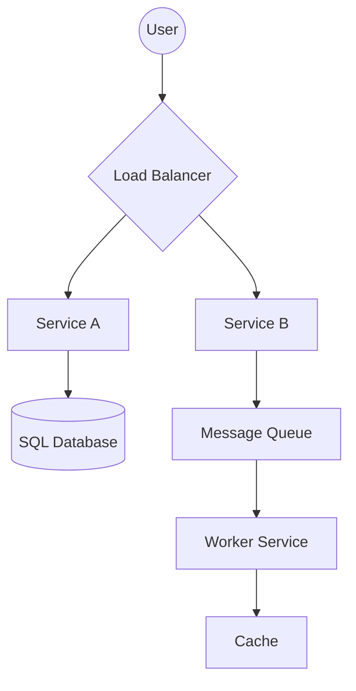

# How to Read System Design Diagrams: Decoding the Blueprint

## 1. Beginner-friendly Hinglish Explanation 🇮🇳
Bhai, **System Design Diagrams** software engineering ki "Language" hain. 

Agar aap kisi senior engineer se baat karoge, toh wo code nahi dikhayega, wo ek diagram banayega. Is module mein hum sikhate hain ki: 
- Wo chote boxes (Services) kya hain? 
- Wo lines aur arrows (Data flow) kya batate hain? 
- Cylinder (Database), Cloud (Internet), aur Gears (Processors) ka matlab kya hai? 
Diagram padhna seekh liya, toh aap kisi bhi complex system ko 1 minute mein samajh jaoge.

---

## 2. Deep Technical Explanation
System design diagrams use standard symbols and notations to represent architectural components and their interactions.

### Standard Symbols
- **Boxes**: Microservices or Applications.
- **Cylinders / Barrels**: Databases (SQL/NoSQL).
- **Stack of 3 Lines**: Load Balancer.
- **Envelope / Queue**: Message Queues (Kafka/RabbitMQ).
- **Cloud**: External APIs or Internet.
- **Small Square with 'C'**: Cache (Redis/Memcached).

### Direction of Arrows
- **Single Arrow**: One-way request or data flow.
- **Double Arrow**: Bi-directional communication (WebSockets).
- **Dashed Line**: Optional or asynchronous flow.

---

## 3. Architecture Diagrams
**Visual Key (Cheat Sheet):**

---

## 4. Scalability Considerations
- **Replication Notation**: Showing "x3" or "Cluster" next to a box to indicate that multiple instances are running.

---

## 5. Failure Scenarios
- **Dotted Paths**: Showing what happens if the primary path is blocked. (E.g., "If Cache misses, go to DB").

---

## 6. Tradeoff Analysis
- **Complexity vs. Readability**: A diagram with 1000 boxes is "Correct" but "Useless" for an interview. Always simplify.

---

## 7. Reliability Considerations
- **Separation of Concerns**: Ensuring that "Frontend" and "Backend" are clearly separated by a "Gateway" or "API" line.

---

## 8. Security Implications
- **Trust Boundaries**: Drawing a line around your "Private VPC" to show which components are exposed to the public internet and which are hidden.

---

## 9. Cost Optimization
- **Infrastructure Labels**: Labeling components with their cloud service names (e.g., "S3" vs "EBS") to indicate cost awareness.

---

## 10. Real-world Production Examples
- **Mermaid.js**: The tool we are using right now! It's the industry standard for "Diagrams as Code."
- **Excalidraw / Lucidchart**: The most popular tools used during actual system design interviews.

---

## 11. Debugging Strategies
- **Trace the Request**: "Pick a user request and follow it through every box in the diagram to see where it could fail."

---

## 12. Performance Optimization
- **Identifying Bottlenecks**: Looking at the diagram and finding the "Single Box" where all arrows meet. That's your bottleneck!

---

## 13. Common Mistakes
- **Messy Lines**: Crossing lines so much that the diagram looks like "Spaghetti."
- **Missing Labels**: Boxes without names. (Is it a DB? Is it a Cache? Who knows!).

---

## 14. Interview Questions
1. What does a 'Cylinder' symbol represent in a system design diagram?
2. How do you represent an 'Asynchronous' process in a diagram?
3. Why is it important to draw 'Load Balancers' even if they are 'Invisible' in code?

---

## 15. Latest 2026 Architecture Patterns
- **Animated Diagrams**: Using tools like **IcePanel** to show data actually "Moving" through the system in real-time.
- **AI-Generated Diagrams**: Asking an AI to "Draw the architecture of a Chat App" and then modifying the resulting code.
- **3D Topology**: Representing cloud architecture in 3D to show "Regions" and "Availability Zones" more clearly.
	
