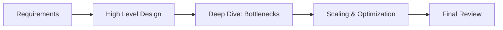

# System Design Interview Framework: The 2026 Master Plan

## 1. Beginner-friendly Hinglish Explanation 🇮🇳
Bhai, **System Design Interview** koi "Sahi Jawab" (Correct Answer) dhoondne ka game nahi hai. Ye ek "Discussion" hai. 

Interviewer ye nahi dekh raha ki aapne perfect diagram banaya ya nahi. Wo ye dekh raha hai ki: 
- Kya aap bade aur "Vague" (unclear) problems ko chote tukdon mein baant sakte ho? 
- Kya aap **Tradeoffs** (Nafa-Nuksan) samajhte ho? 
- Kya aap "Pressure" mein sahi decisions le sakte ho? 
Ye framework aapko ek "Step-by-Step" rasta deta hai taaki aap interview ke 45 minutes mein bhatko nahi.

---

## 2. Deep Technical Explanation
A successful system design interview follows a structured approach to ensure all critical architectural aspects are covered.

### The 4-Step Framework
1. **Step 1: Understand the Problem & Scope (5-10 mins)**:
    - Ask clarifying questions.
    - Define Functional (Features) and Non-Functional (Scale, Availability) requirements.
2. **Step 2: Propose High-Level Design (10-15 mins)**:
    - Draw the basic flow (Client -> LB -> Server -> DB).
    - Get "Buy-in" from the interviewer before moving to details.
3. **Step 3: Design Deep Dive (15-20 mins)**:
    - Focus on the "Hardest" parts (e.g., "How to handle 1M concurrent users?").
    - Discuss specific components (Cache, Sharding, Message Queues).
4. **Step 4: Wrap Up (5 mins)**:
    - Summarize the design.
    - Mention future improvements or potential bottlenecks.

---

## 3. Architecture Diagrams
**The Interview Progression:**

---

## 4. Scalability Considerations
- **Don't Over-engineer early**: Don't start with "1000 nodes" for a system that only has 100 users. Build for the scale the interviewer asks for.

---

## 5. Failure Scenarios
- **The "Silence" Trap**: If you don't talk for 5 minutes while drawing, the interviewer doesn't know what's in your head. **Think Out Loud!**

---

## 6. Tradeoff Analysis
- **The Golden Question**: Always explain *why* you chose X over Y. (E.g., "I picked NoSQL because we need high write throughput, even if we lose strong consistency").

---

## 7. Reliability Considerations
- **SPOF (Single Point of Failure)**: Every time you add a component, ask: "What happens if this dies?".

---

## 8. Security Implications
- **Auth & Privacy**: Mentioning "We will use JWT for auth" or "Data will be encrypted at rest" shows you are a senior-level engineer.

---

## 9. Cost Optimization
- **Efficiency**: Mentioning how you would save money (e.g., "We will use a CDN to reduce egress costs") earns extra points.

---

## 10. Real-world Production Examples
- **Amazon's "Working Backwards"**: Always starting with the customer's problem before designing the tech.
- **Google's "Design Docs"**: The structure of a real-world design doc is exactly what you are trying to simulate in an interview.

---

## 11. Debugging Strategies
- **Component Failure**: "If the cache is down, we will fall back to the DB but implement a circuit breaker to avoid crashing it."

---

## 12. Performance Optimization
- **Estimation**: Using "Back-of-the-envelope" math to prove that your design can actually handle the traffic.

---

## 13. Common Mistakes
- **Jumping to Diagrams too fast**: Not asking "How many users?" and starting to draw.
- **Memorizing Diagrams**: Trying to force a "WhatsApp design" into a "Twitter problem."

---

## 14. Interview Questions
1. Walk me through your 4-step framework for a system design interview.
2. How do you handle an interviewer who keeps changing the requirements?
3. What are 'Non-functional Requirements' and why are they critical?

---

## 15. Latest 2026 Architecture Patterns
- **AI-Assisted Design**: Interviewers are now asking "How would you integrate an LLM into this architecture?".
- **Serverless-First Design**: Starting with serverless components to show agility, then moving to K8s for scale.
- **Observability-First**: Designing the system with "Metrics and Traces" in mind from minute one.
	
