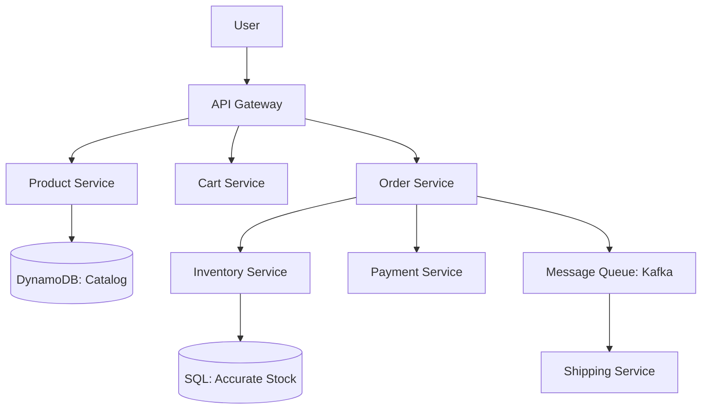

# Designing Amazon E-Commerce: The Everything Store

## 1. Beginner-friendly Hinglish Explanation 🇮🇳
Bhai, **Amazon** design karna "Duniya ki sabse badi dukaan" sambhalne jaisa hai. 

Isme 3 bade "Pange" (Challenges) hote hain: 
1. **Inventory Management**: Agar sirf 1 iPhone bacha hai aur 1000 log "Buy" click karte hain, toh kisko milega? (Iske liye **Distributed Locking** aur **Transactions** chahiye). 
2. **Search & Recommendation**: 10 crore products mein se wahi dikhana jo user ko chahiye. 
3. **Cart & Checkout**: User ka "Cart" kabhi khona nahi chahiye, chahe net chala jaye ya app crash ho jaye. 
Amazon "Microservices" ka pioneer hai—yahan har choti cheez (Review, Price, Stock) ek alag service hai.

---

## 2. Deep Technical Explanation
Amazon's architecture is the gold standard for high-availability, massively distributed systems.

### Core Components
- **Product Catalog**: Stores millions of items. Uses a mix of **NoSQL (DynamoDB)** for flexible attributes and **Search Index (Elasticsearch)**.
- **Inventory Service**: Tracks stock levels across thousands of warehouses. High consistency is required here.
- **Cart Service**: Highly available and durable. Usually uses **DynamoDB** with a "Session ID" as the key.
- **Order Service**: Orchestrates the payment, inventory deduction, and shipping. (Uses the **Saga Pattern**).
- **Recommendation Engine**: Analyzes past buys and views to show "Related Items."

### Handling "Flash Sales"
- **Queueing**: Every "Buy" request goes into a queue to avoid overwhelming the database.
- **Optimistic Locking**: Assume the stock is available, but check and decrement at the last millisecond of the transaction.

---

## 3. Architecture Diagrams
**Amazon E-Commerce Architecture:**

---

## 4. Scalability Considerations
- **Database Sharding**: Sharding by `Category` or `Merchant ID` to handle millions of transactions per second.
- **Global Presence**: Using **CloudFront (CDN)** to store product images in every major city.

---

## 5. Failure Scenarios
- **Overselling**: Two people buying the last item at the same time. (Fix: **Strong Consistency in Inventory DB**).
- **Payment Timeout**: Money cut from the user's bank, but the order wasn't created. (Fix: **Idempotent API and Automatic Refunds**).

---

## 6. Tradeoff Analysis
- **Availability vs. Consistency**: For "Product Reviews," Availability is key (who cares if a review is 10s late?). For "Payments," Consistency is everything.

---

## 7. Reliability Considerations
- **Eventual Consistency in Search**: It's okay if a new product takes 1 minute to show up in search results.

---

## 8. Security Implications
- **PCI Compliance**: Ensuring credit card data is never stored on Amazon's own servers (using **Stripe/Braintree** or encrypted enclaves).
- **Account Takeover**: Detecting a hacker trying to buy 100 MacBooks with a stolen account.

---

## 9. Cost Optimization
- **Data Retention**: Deleting "Carts" that haven't been touched in 30 days.
- **Cold Storage**: Moving 10-year-old "Order History" to cheap storage.

---

## 10. Real-world Production Examples
- **DynamoDB**: Amazon built this NoSQL database because they needed something that could scale to "Infinite" traffic during Black Friday.
- **AWS**: Amazon's internal infrastructure was so good they started selling it to the world.

---

## 11. Debugging Strategies
- **Tracing an Order**: Following a single `Order_ID` through the 50+ microservices it touches to find where it got stuck.

---

## 12. Performance Optimization
- **SSR (Server Side Rendering)**: Sending the "Buy" button and "Price" first so the user can see them instantly while the "Reviews" load in the background.

---

## 13. Common Mistakes
- **Single DB for everything**: Using the same DB for "Product Info" and "Order History." (They should be separate microservices!).
- **No Idempotency**: Charging a customer twice because they clicked the "Pay" button twice.

---

## 14. Interview Questions
1. How do you design an 'Inventory Management System' to handle flash sales?
2. What is the 'Saga Pattern' and why is it used for Orders?
3. How do you handle 'Inconsistent Data' between the Product and Search services?

---

## 15. Latest 2026 Architecture Patterns
- **AI-Native Shopping Assistant**: An LLM that lives in the search bar and can answer: "Suggest a blue shirt under $50 that goes with black pants."
- **Just-Walk-Out Tech (Amazon Go)**: Using computer vision and edge computing to track what you pick up and charge your app automatically.
- **Anticipatory Shipping**: Using AI to start shipping a product to your city *before* you even click "Buy," based on your browsing history.
	
