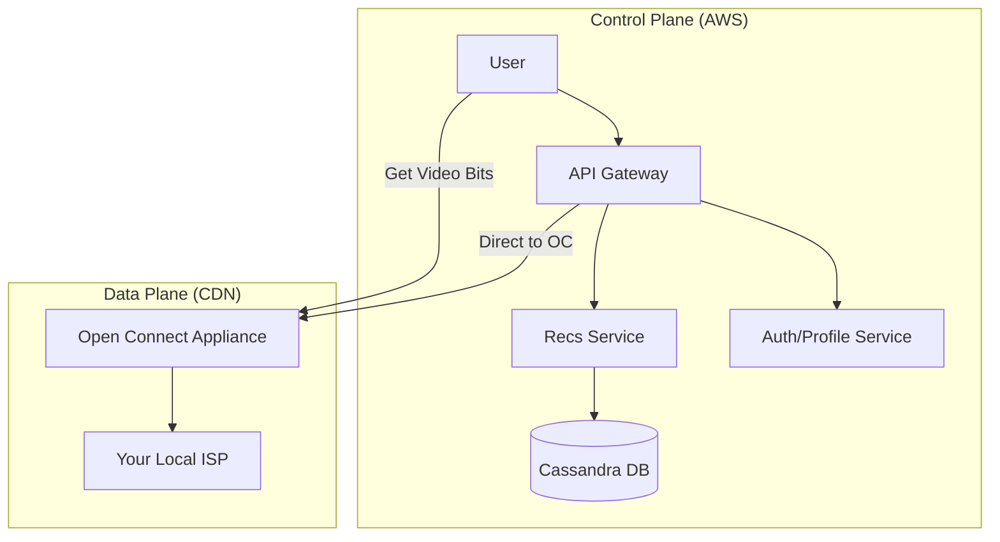

# Designing Netflix Video Streaming: The Global Cinema

## 1. Beginner-friendly Hinglish Explanation 🇮🇳
Bhai, **Netflix** design karna sirf "Video play karna" nahi hai. 

Isme 3 bade challenges hote hain: 
1. **Transcoding**: Jab koi movie upload hoti hai, toh Netflix use 1000+ versions mein badalta hai (Different sizes, different languages, different internet speeds). 
2. **Global Delivery**: Agar movie USA ke server par hai, toh India mein "Buffering" hogi. Iske liye Netflix apna khud ka **CDN (Open Connect)** use karta hai jo movies ko aapke internet provider (ISP) ke office mein hi rakh deta hai. 
3. **Recommendation**: Netflix ka 80% traffic "Recommendations" se aata hai.

---

## 2. Deep Technical Explanation
Netflix's architecture is divided into the **Control Plane** (AWS) and the **Data Plane** (Open Connect CDN).

### Core Components
1. **Control Plane (AWS)**: Handles everything *before* you press Play.
    - User Auth, Billing, Recommendations, Search.
    - **Microservices Architecture**: Thousands of small services talking to each other via **gRPC**.
2. **Data Plane (Open Connect)**: Handles the actual video bits.
    - Custom hardware (OCA - Open Connect Appliances) placed inside ISPs globally.
    - **Video Transcoding**: Converting raw video into chunks for **Adaptive Bitrate Streaming (ABR)**.

### Adaptive Bitrate Streaming (ABR)
- The video is split into 2-10 second chunks.
- Each chunk is available in multiple qualities (360p, 720p, 4K).
- The Netflix app detects your internet speed and requests the "Best" chunk it can handle.

---

## 3. Architecture Diagrams
**Netflix Hybrid Architecture:**

---

## 4. Scalability Considerations
- **Storage for 1000 Versions**: A single 4K movie takes terabytes of space because of all the different device formats (iPhone, TV, Browser).
- **Peak Traffic**: Designing for the "Friday Night" spike where everyone watches the latest show at the same time.

---

## 5. Failure Scenarios
- **CDN Node Down**: If the local OCA is down, the app must automatically failover to the next closest data center.
- **Microservice Outage**: If the "Recommendations" service is down, the home screen should show "Generic Popular" shows instead of an error.

---

## 6. Tradeoff Analysis
- **Build vs Buy CDN**: Netflix decided to build their own (Open Connect) because third-party CDNs (Akamai/Cloudflare) were too expensive at their scale.

---

## 7. Reliability Considerations
- **Chaos Engineering**: Netflix created **Chaos Monkey** to kill their own AWS servers in production to ensure the system is resilient.

---

## 8. Security Implications
- **DRM (Digital Rights Management)**: Ensuring that you can't just "Download and Copy" the video files.
- **Secure Token Exchange**: Verifying that the user who is watching has actually paid for their subscription.

---

## 9. Cost Optimization
- **S3 Tiering**: Moving old movies that no one watches to "Cold Storage."
- **Encoding Optimization**: Using AI to find the best compression for a specific scene (e.g., a "Dark" scene needs less data than a "Bright action" scene).

---

## 10. Real-world Production Examples
- **Hystrix**: The circuit breaker library Netflix built to handle microservice failures.
- **Eureka**: Their service discovery tool.
- **Zuul**: Their API Gateway.

---

## 11. Debugging Strategies
- **Distributed Tracing**: Using tools to see why a specific user's "Play" button failed.
- **Playback Telemetry**: Monitoring "Buffering Rate" and "Start Time" for every single user.

---

## 12. Performance Optimization
- **Predictive Caching**: Moving the latest "Stranger Things" episodes to the local ISP caches *before* the show is even released.

---

## 13. Common Mistakes
- **Centralizing everything**: Trying to serve all video from one data center.
- **Ignoring Device Diversity**: Forgetting that some users are on 10-year-old smart TVs that have very slow CPUs.

---

## 14. Interview Questions
1. How does 'Adaptive Bitrate Streaming' work?
2. Why does Netflix use a Hybrid Cloud (AWS + Open Connect) strategy?
3. What is 'Micro-segmentation' in the context of Netflix services?

---

## 15. Latest 2026 Architecture Patterns
- **Cloud Gaming Integration**: Serving high-performance interactive games using the same low-latency CDN infrastructure.
- **AI-Enhanced Upscaling**: Sending a 1080p video and using the user's TV/Phone AI to "Upscale" it to 4K to save 70% on bandwidth.
- **Multicast Delivery**: Delivering a single video stream to 10,000 users simultaneously in one neighborhood to save on backbone network costs.
	
