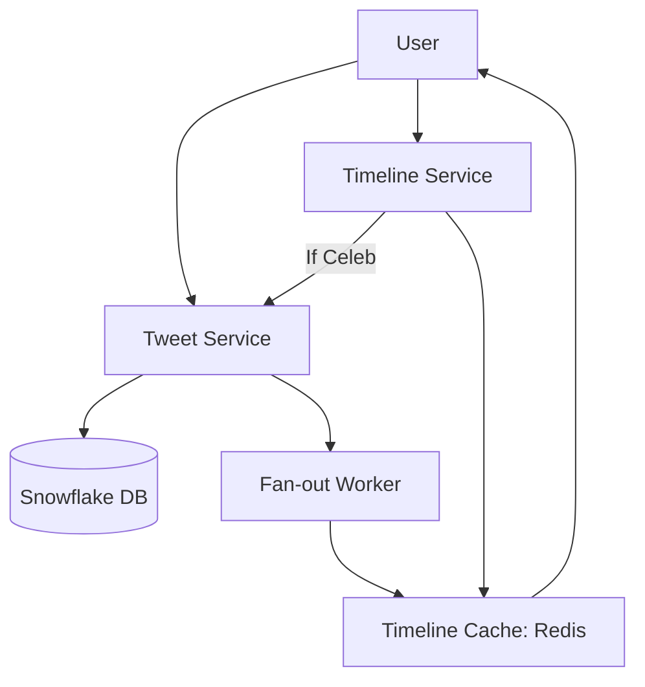

# Designing Twitter (X) Feed: The Newsfeed Challenge

## 1. Beginner-friendly Hinglish Explanation 🇮🇳
Bhai, **Twitter (X)** design karne mein sabse bada panga "Feed" banana hai. 

Socho aap 500 logon ko follow karte ho. Jab aap app kholte ho, toh system ko in 500 logon ke "Latest Tweets" dikhane hain. 
- **Pull Model**: Jab aap app kholo, tab hum database scan karein. (Ye 100 followers ke liye thik hai, par 10 crore ke liye bohot slow hai). 
- **Push Model (Fan-out)**: Jab koi tweet karta hai, toh hum use uske sabhi followers ke "Inbox" (Cache) mein daal dete hain. Jab aap app kholte ho, toh aapka inbox pehle se taiyaar hota hai. 
Challenge tab aata hai jab **Amitabh Bachchan** tweet karte hain—kyunki unke millions of followers hain aur sabko "Push" karne mein system crash ho sakta hai!

---

## 2. Deep Technical Explanation
Twitter's architecture is a mix of high-write throughput (Tweeting) and extreme-read throughput (Timeline).

### Core Requirements
- **Functional**: Post tweets, Follow/Unfollow, Home Timeline, User Timeline, Search.
- **Non-Functional**: High availability, Low latency (<200ms for timeline), Eventual consistency.

### Timeline Models
1. **Push Model (Fan-out on Write)**: When a tweet is posted, it's pushed to the caches of all followers. Fast reads, slow writes.
2. **Pull Model (Fan-out on Read)**: Timeline is built when the user requests it. Slow reads, fast writes.
3. **Hybrid Model**: 
    - Use **Push** for regular users.
    - Use **Pull** for "Celebrities" (High fan-out users). When you load your feed, you pull the celeb's latest tweets and mix them with your pre-computed "Push" inbox.

---

## 3. Architecture Diagrams
**Twitter Feed Architecture:**

---

## 4. Scalability Considerations
- **Fan-out Bottleneck**: A celebrity with 100M followers. A single tweet can take minutes to reach everyone. (Fix: **Celebrity Exception Logic**).
- **In-memory Timeline**: Timelines are stored in **Redis** (List or Sorted Set) for sub-millisecond response.

---

## 5. Failure Scenarios
- **Cache Eviction**: If a user hasn't logged in for a year, their pre-computed timeline is deleted to save space. When they return, we must "Re-build" it from the DB.
- **Thundering Herd**: Millions of people clicking a "Trending" hashtag at once.

---

## 6. Tradeoff Analysis
- **Consistency vs. Latency**: It's okay if you see a tweet 5 seconds after it's posted (Eventual Consistency), but the app must feel fast (Low Latency).

---

## 7. Reliability Considerations
- **Deduplication**: Ensuring that if the Fan-out worker restarts, the same tweet doesn't appear twice in your feed.

---

## 8. Security Implications
- **Private Accounts**: Ensuring that a private user's tweets never "Fan-out" to people who don't follow them.

---

## 9. Cost Optimization
- **Tiered Storage**: Keeping only the "Last 200 tweets" for each user in the fast Redis cache. Older tweets are fetched from the cold database.

---

## 10. Real-world Production Examples
- **Twitter's 'Snowflake'**: Their custom ID generator to create 64-bit unique, time-ordered IDs at massive scale.
- **Apache Manhattan**: A distributed database Twitter built to handle their specific needs.

---

## 11. Debugging Strategies
- **Timeline Inspection**: Seeing why a specific tweet is missing from a user's feed.
- **Fan-out Latency Monitoring**: Measuring how many seconds it takes for a "Regular" tweet to reach 99% of followers.

---

## 12. Performance Optimization
- **Protocol Buffers**: Using binary format to reduce the size of the timeline data transferred to the mobile app.
- **Pre-fetching**: Predicting that a user will scroll down and loading the next 20 tweets in the background.

---

## 13. Common Mistakes
- **Using 'JOIN' in SQL to build the feed**: Doing `SELECT * FROM tweets JOIN follows...` for 100 million users will kill the database in 1 second.
- **No Rate Limiting on Fan-out**: Letting one celebrity tweet crash the whole background worker cluster.

---

## 14. Interview Questions
1. Explain the 'Fan-out' problem in the context of Twitter.
2. How do you handle 'Celebrity' accounts with millions of followers?
3. What is the 'Pull vs Push' model for social media feeds?

---

## 15. Latest 2026 Architecture Patterns
- **AI-Ranked Timelines**: Moving away from "Reverse-chronological" (latest first) to "Interest-based" (AI picks the best 20 tweets) in real-time.
- **Vector-Search for Trends**: Finding "Trending topics" by looking at the semantic similarity of millions of tweets, not just hashtags.
- **Edge-Cached Feeds**: Storing the top 100 tweets of every user in the CDN Edge closest to them.
	
