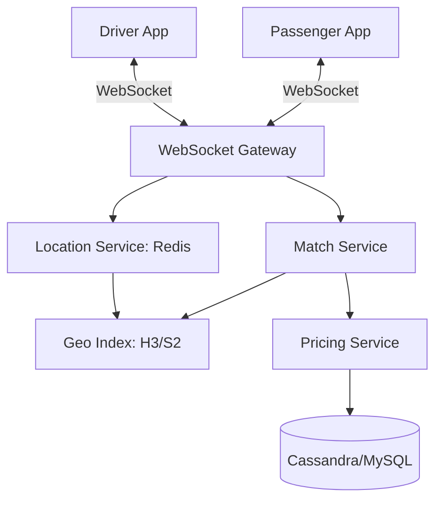

# Designing Uber Ride-Sharing: The Real-time Logistics Engine

## 1. Beginner-friendly Hinglish Explanation 🇮🇳
Bhai, **Uber** design karna ek bohot bada "Geometry" aur "Time" ka problem hai. 

Isme do main khiladi hain: **Rider** (aap) aur **Driver**. 
1. **Location Tracking**: Har 4 second mein driver ka phone "Main yahan hoon" bolta hai. (Iske liye hum **WebSockets** aur **Geo-hashing** use karte hain). 
2. **Matching**: System ko find karna hai ki "Sabse paas kaunsa driver hai?". Par "Paas" ka matlab sirf distance nahi, "Traffic" aur "Time" bhi hai. 
3. **Surge Pricing**: Jab barish hoti hai ya demand badhti hai, toh system ko turant price badhana hota hai. 
Ye pura system "Real-time" hai—har second data badal raha hai.

---

## 2. Deep Technical Explanation
Uber's architecture is built around high-frequency location updates and geospatial indexing.

### Core Components
- **Passenger/Driver Apps**: Send location updates every few seconds.
- **Websocket Gateway**: Manages millions of open connections for real-time tracking.
- **Geospatial Index (Google S2 / H3)**: Divides the world into tiny "Cells" (Hinglish: "Chote chote dibbe") to quickly find nearby drivers.
- **Match Service**: Pairs a rider with the "Optimal" driver.
- **Pricing Service**: Calculates trip cost + Surge based on supply/demand.
- **Trip Service**: Manages the lifecycle of a ride (Started, Completed, Cancelled).

---

## 3. Architecture Diagrams
**Uber High-Level Design:**

---

## 4. Scalability Considerations
- **Write-Heavy Location Updates**: Millions of drivers updating location every 4 seconds. (Fix: **In-memory store like Redis** for transient location).
- **Quadtree/Geohash Bottleneck**: Traditional databases are slow for "Find things near this point." (Fix: **Google S2 Geometry Library**).

---

## 5. Failure Scenarios
- **Matching Fail**: A driver accepts a ride but their internet dies. (Fix: **Timeout and Re-match**).
- **Surge Calculation Lag**: The price stays low while demand is high, losing money for the company.

---

## 6. Tradeoff Analysis
- **Consistency vs. Availability**: Uber chooses **Availability**. If the primary DB is down, it's better to give a slightly wrong price than to stop people from getting home.

---

## 7. Reliability Considerations
- **Idempotency**: Ensuring that if you click "Book Ride" twice, it doesn't book two separate cars.

---

## 8. Security Implications
- **Privacy**: Masking the rider's phone number so the driver can't see it (using **Twilio Proxy**).
- **GPS Spoofing**: Drivers using apps to fake their location to get more rides.

---

## 9. Cost Optimization
- **Batching Location Updates**: Sending location every 4 seconds instead of every 0.1 second to save battery and network costs.

---

## 10. Real-world Production Examples
- **Marketplace Service**: The brain that handles the matching logic.
- **Ringpop**: A library Uber built to handle distributed coordination across their services.
- **Schemaless**: A custom database Uber built on top of MySQL to handle their massive data growth.

---

## 11. Debugging Strategies
- **Trip Lifecycle Tracing**: Seeing every event (Rider requested -> Match found -> Driver arrived) with timestamps.
- **Geo-visualization**: A real-time map for engineers to see where the "Hot spots" are.

---

## 12. Performance Optimization
- **Persistent WebSockets**: Avoiding the overhead of opening a new HTTPS connection for every single location update.
- **H3 (Uber's Hexagonal Index)**: Using hexagons instead of squares for the geo-index because hexagons have equal distance to all neighbors.

---

## 13. Common Mistakes
- **Using a standard SQL query for distance**: `SELECT * FROM drivers WHERE distance(lat, lon) < 1km`. (This will crash the DB at scale!).
- **Storing full history in Redis**: Redis is expensive. Store "Current Location" in Redis and "History" in a cold database like Cassandra.

---

## 14. Interview Questions
1. How do you design a 'Location Tracking' system for millions of drivers?
2. What are 'S2 Cells' and 'Geohashing'?
3. How do you implement 'Surge Pricing' in real-time?

---

## 15. Latest 2026 Architecture Patterns
- **AI-Predicted Demand**: Predicting where riders will be in 30 minutes and telling drivers to move there *before* the request even happens.
- **Autonomous Fleet Management**: Managing a mix of human drivers and self-driving "Robotaxis" in the same system.
- **V2X (Vehicle-to-Everything)**: The car's computer talking directly to the Uber cloud to report traffic and road conditions automatically.
	
