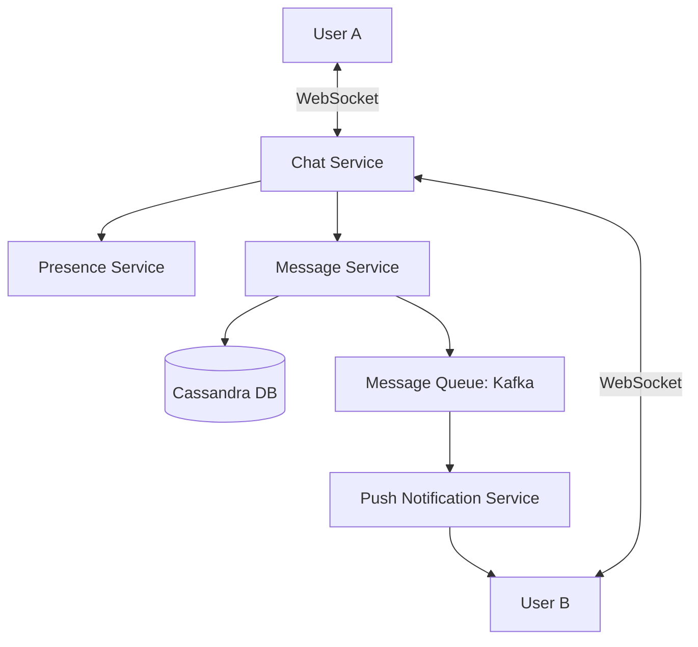

# Designing WhatsApp Messenger: A Case Study

## 1. Beginner-friendly Hinglish Explanation 🇮🇳
Bhai, **WhatsApp** design karna "Scalability" ka asli imtihan hai. 

Isme 2 bade challenges hote hain: 
1. **Real-time Delivery**: Jaise hi main "Hi" bolun, aapke phone par notification aa jana chahiye. (Iske liye hum **WebSockets** use karte hain). 
2. **State Management**: System ko pata hona chahiye ki aap "Online" ho ya "Offline". Agar offline ho, toh message ko "Queue" mein rakhna hai aur jab aap online aao toh "Push" karna hai. 
Aur haan, **Privacy** ke liye "End-to-End Encryption" hona compulsory hai taaki WhatsApp khud bhi aapke messages na padh sake.

---

## 2. Deep Technical Explanation
WhatsApp needs to handle billions of users with near-zero latency and high reliability.

### Core Requirements
- **Functional**: 1-on-1 chat, Group chat, Message status (Sent, Delivered, Read), Last seen, Media sharing.
- **Non-Functional**: Low latency, High availability, 100% Message durability, End-to-end encryption.

### Key Components
- **Chat Service**: Manages WebSocket connections for real-time delivery.
- **Presence Service**: Tracks online/offline status using heartbeats.
- **Message Store**: Traditionally uses **Cassandra** or **HBase** for massive write throughput.
- **Media Service**: S3 for storage + CDN for global delivery.
- **Push Notification Service**: FCM/APNS for offline users.

---

## 3. Architecture Diagrams
**WhatsApp High-Level Design:**

---

## 4. Scalability Considerations
- **Connection Management**: One server can handle ~65k connections. For 1 billion users, you need thousands of chat servers and a way to route messages between them.
- **Group Chat Explosion**: If a group has 500 people, 1 message creates 500 "Deliveries." (Fix: **Asynchronous Fan-out**).

---

## 5. Failure Scenarios
- **Network Partition**: User A is on Server 1, User B is on Server 2. If the link between servers is broken, they can't chat.
- **Database Lag**: A user sends a message but the receiver gets it 10 seconds later because the DB is slow.

---

## 6. Tradeoff Analysis
- **Consistency vs. Availability**: WhatsApp prioritizes **Availability**. It's okay if a "Double tick" is 1 second late, but the app must never stop sending messages.

---

## 7. Reliability Considerations
- **Ack-Based Protocol**: The server doesn't delete the message from the "Outgoing Queue" until the receiver's phone sends an "ACK" (Acknowledgement) back.

---

## 8. Security Implications
- **Signal Protocol**: Every message is encrypted on the sender's phone and decrypted only on the receiver's phone. The server only sees "Gibberish."

---

## 9. Cost Optimization
- **Binary Format**: Using **Protocol Buffers (Protobuf)** instead of JSON to save 60% on bandwidth for billions of small messages.

---

## 10. Real-world Production Examples
- **Erlang/Elixir**: WhatsApp famously used Erlang to handle millions of concurrent connections per server.
- **MongooseIM**: An open-source version of the XMPP server technology WhatsApp originally used.

---

## 11. Debugging Strategies
- **Message ID Tracing**: Every message has a unique UUID. If a message "Disappears," we trace that UUID through the logs of all services.

---

## 12. Performance Optimization
- **Connection Pooling**: Reusing TCP connections to the database to avoid the "Handshake" delay.
- **Edge Termination**: Terminating the SSL/WebSocket connection at the nearest data center.

---

## 13. Common Mistakes
- **Using HTTP Polling**: Asking the server "Any new messages?" every second. (This will kill the battery and the server!).
- **Storing Messages Forever**: WhatsApp deletes messages from the server once they are delivered to the device. (Saves petabytes of storage).

---

## 14. Interview Questions
1. How do you design a 'Presence Service' (Online/Offline status)?
2. How do you scale 'Group Chats' with 1000s of members?
3. Why did WhatsApp choose Erlang over Java/C++?

---

## 15. Latest 2026 Architecture Patterns
- **WebTransport over QUIC**: Replacing WebSockets for even faster message delivery and better performance on "Flaky" mobile networks.
- **AI-Managed Content Moderation**: Scanning for "Spam" or "Malware" links locally on the phone before they are even sent.
- **Decentralized Storage**: Using IPFS or similar tech to store media files so they don't depend on a central S3 bucket.
	
