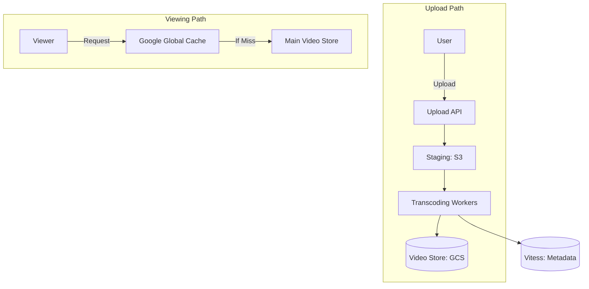

# Designing YouTube: The Global Video Infrastructure

## 1. Beginner-friendly Hinglish Explanation 🇮🇳
Bhai, **YouTube** design karna matlab "Video ki duniya" sambhalna. 

Isme 2 bade "Challenges" hain: 
1. **Upload (The Factory)**: Jab aap video upload karte ho, YouTube use hazaron formats mein convert karta hai (4K, 1080p, 144p) taaki wo slow internet par bhi chale. Isse **Transcoding** kehte hain. 
2. **Download (The Delivery)**: Millions of log ek sath video dekh rahe hain. Iske liye YouTube ne apne khud ke "Google Global Cache" (GGC) nodes lagaye hain har ISP ke office mein. 
Iska matlab, jab aap "CarryMinati" ki video dekhte ho, wo USA se nahi, balki aapke shehar ke paas wale server se aa rahi hoti hai.

---

## 2. Deep Technical Explanation
YouTube's architecture is optimized for massive data storage, high-throughput ingestion, and low-latency delivery.

### The Upload Pipeline
1. **Raw Upload**: Video is uploaded to a staging area (S3/GCS).
2. **Transcoding**: A distributed worker fleet (thousands of servers) takes the video and converts it into multiple resolutions and codecs (H.264, VP9, AV1).
3. **Thumbnail Generation**: Creating several images from the video for preview.
4. **Metadata Indexing**: Saving title, tags, and description into a Search Index (Elasticsearch) and a DB (Vitess/MySQL).

### The Streaming Pipeline
- **DASH (Dynamic Adaptive Streaming over HTTP)**: The video is divided into small 5-second chunks. The player chooses the best quality chunk based on your internet speed.

---

## 3. Architecture Diagrams
**YouTube High-Level Architecture:**

---

## 4. Scalability Considerations
- **Storage for Exabytes**: YouTube adds petabytes of video daily. (Fix: **Colossus** - Google's distributed file system).
- **Metadata Scale**: Using **Vitess** to shard MySQL across thousands of nodes to handle billions of "Like" counts and comments.

---

## 5. Failure Scenarios
- **Transcoding Backlog**: If 1 million people upload a video at the same time, the processing queue gets long. (Fix: **Priority Queueing** for verified creators).
- **Cache Miss**: If a video isn't in the local ISP cache, the "First byte" time increases.

---

## 6. Tradeoff Analysis
- **Quality vs. Storage**: Should we keep 8K versions of every video? (No, only for popular ones to save cost).

---

## 7. Reliability Considerations
- **Geographic Redundancy**: Storing at least 3 copies of every video in different parts of the world to survive a data center fire.

---

## 8. Security Implications
- **Content ID**: Using AI to automatically detect and block "Copyrighted" music or movies during upload.
- **Child Safety**: Automatically flagging "Adult" content to keep it away from kids.

---

## 9. Cost Optimization
- **Tiered Transcoding**: Only transcode popular videos into the expensive **AV1** codec (which saves bandwidth but is slow to encode). Use **H.264** for everything else.

---

## 10. Real-world Production Examples
- **Vitess**: The database system YouTube built to scale MySQL. It's now used by Slack, GitHub, and JD.com.
- **QUIC / HTTP3**: YouTube was the first to use this to make video start times 10% faster on mobile.

---

## 11. Debugging Strategies
- **Video Playback Logs**: Tracking every "Buffer event" to see if a specific ISP or region has a network problem.
- **Transcoding Error Alerts**: If a specific video format fails to encode, the worker re-tries it automatically.

---

## 12. Performance Optimization
- **Zero-Copy Video Serving**: Sending video data from the disk directly to the network card without touching the server's CPU.
- **Edge Search**: Caching the "Search results" for trending topics (e.g., "World Cup") at the CDN edge.

---

## 13. Common Mistakes
- **No Adaptive Bitrate**: Trying to send a 4K file to a user with 2G internet. (The video will never load!).
- **Centralizing Metadata**: Keeping all "Views" and "Likes" in one database table. (It will bottleneck the whole platform).

---

## 14. Interview Questions
1. How does 'Video Transcoding' scale at YouTube?
2. What is the role of 'Adaptive Bitrate Streaming (DASH)'?
3. How do you handle 'Popularity Spikes' when a video goes viral?

---

## 15. Latest 2026 Architecture Patterns
- **AI-Native Transcoding**: Using AI to "Fill in the gaps" of a low-quality video, making 480p look like 1080p in real-time on the user's device.
- **Shorts-Optimization**: A completely different architecture for 60-second vertical videos that prioritizes "Swipe latency" over "Full-quality buffering."
- **Immersive Video (VR/AR)**: Delivering 360-degree 16K video streams using "Tiled Encoding" (only sending the part of the video the user is looking at).
	
