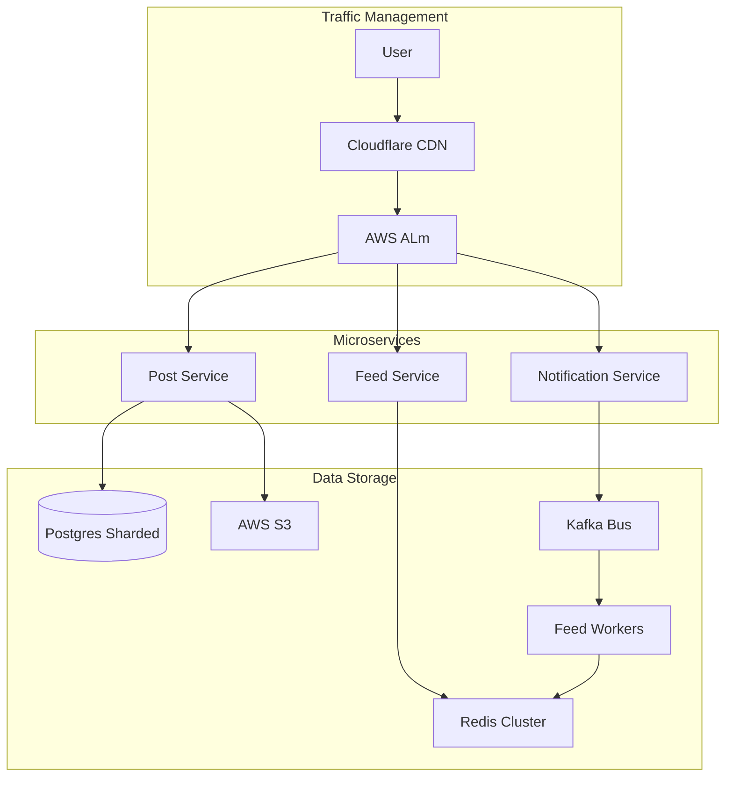

# Building a Scalable Social Network: The Capstone Implementation

## 1. Beginner-friendly Hinglish Explanation 🇮🇳
Bhai, ye aapka "DREAM project" hai. 

Humein ek aisa social network banana hai jo: 
- **Scale** kare (1 crore users handle kare). 
- **Fast** ho (Feed 200ms mein khule). 
- **Safe** ho (Privacy aur Encryption ke saath). 
Isme hum wo sab use karenge jo humne pichle 18 modules mein seekha hai—Load Balancers, Sharded Databases, Redis Caching, Kafka Queues, aur Global CDNs. 
Ye module aapko sikhayega ki kaise ek "Idea" ko "Massive Architecture" mein badalte hain.

---

## 2. Deep Technical Explanation
The goal is to design a high-performance, event-driven social media platform (Instagram clone).

### System Specifications
- **Write Path**: User uploads a photo -> Transcoding worker creates 3 sizes -> URL saved in DB -> Event sent to Kafka.
- **Read Path (Feed)**: User opens app -> Request hits Global Load Balancer -> Timeline Service pulls pre-computed feed from Redis.
- **Analytics Path**: Kafka sends events to ClickHouse -> Real-time dashboards for creators.

### Key Performance Targets
- **Feed Latency**: < 150ms (p99).
- **Photo Upload**: < 2s for 4K images.
- **Availability**: 99.99% (Max 52 mins downtime/year).

---

## 3. Architecture Diagrams
**Detailed Social Network Architecture:**

---

## 4. Scalability Considerations
- **Database Sharding**: Sharding the `Posts` table by `User_ID` to avoid a single DB bottleneck.
- **Fan-out Strategy**: Using a "Push-based" model for regular users and "Pull-based" for celebrities.

---

## 5. Failure Scenarios
- **Redis Cache Flush**: What if Redis loses all data? (Fix: **Warm-up script** to re-populate feed from Postgres).
- **Kafka Congestion**: Millions of posts are pending in the queue. (Fix: **Backpressure** and **Horizontal scaling of workers**).

---

## 6. Tradeoff Analysis
- **Image Quality vs. Storage**: "We will use WebP format instead of JPEG to save 30% storage with no visible quality loss."

---

## 7. Reliability Considerations
- **Multi-AZ Replication**: Database Master in AZ-1, Synchronous Slave in AZ-2. Automatic failover using **Orchestrator**.

---

## 8. Security Implications
- **Rate Limiting**: Blocking any IP that tries to scrape photos (using **WAF**).
- **IDOR Prevention**: Checking permissions for every request: "Does User A actually own Post B?".

---

## 9. Cost Optimization
- **Egress Management**: Using **Cloudflare R2** (zero egress cost) instead of AWS S3 for frequently accessed photos.

---

## 10. Real-world Production Examples
- **Pinterest's 'Pinboard' Architecture**: How they use MySQL and Memcached at extreme scale.
- **Facebook's 'TAO'**: Their distributed data store for the social graph.

---

## 11. Debugging Strategies
- **Distributed Tracing**: Using **Jaeger** to see why a "Post" request is taking 3 seconds.
- **Error Tracking**: Using **Sentry** to catch frontend/backend crashes in real-time.

---

## 12. Performance Optimization
- **HTTP/3 (QUIC)**: Using the latest protocol to reduce the "Start time" of the app on flaky mobile networks.
- **Pre-signed URLs**: Generating temporary S3 URLs so the app can upload directly to S3 without going through our servers.

---

## 13. Common Mistakes
- **No Pagination**: Trying to return 1000 posts in one API call. (Always use **Cursor-based Pagination**!).
- **Sync Calls to slow services**: Making the "Post" API wait for the "Email" service to finish. (Always use **Async Queues**!).

---

## 14. Interview Questions (The Deep Dive)
1. How do you handle 'Data Consistency' between the Postgres DB and the Redis Feed?
2. Why did you choose 'Kafka' instead of a simple 'RabbitMQ'?
3. How do you scale the 'Notification Service' for a user with 10M followers?

---

## 15. Latest 2026 Architecture Patterns
- **AI-Generated Alt-Text**: Automatically generating image descriptions for accessibility using a serverless AI worker.
- **Edge-Computed Feed Ranking**: Moving the "Who's post to show first" logic to the user's phone or nearest edge node to save server CPU.
- **Decentralized Social Protocol (AT/Nostr)**: Making the social network compatible with open protocols so users can move their data easily.
	
