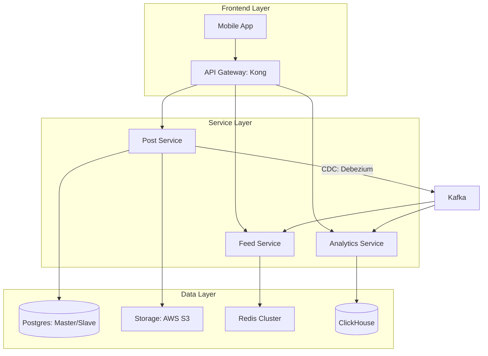

# Capstone Project: Building a Production-Ready System

## 1. Beginner-friendly Hinglish Explanation 🇮🇳
Bhai, **Capstone Project** aapka "Final Exam" hai. 

Abhi tak aapne sab kuch "Tukdon" (Pieces) mein seekha—Caching, Databases, Sharding, Security. Ab waqt hai in sabko jodkar ek "Real-world" system banane ka. 
Is project mein hum sirf diagram nahi banayenge, hum ek **Design Document** likhenge jo ek Senior Engineer (L6/L7) likhta hai. Hum ye assume karenge ki ye system kal "Production" mein jane wala hai aur ispar 10 lakh users aane wale hain. 
Toh chalo, apni "Engineering Cap" pehno aur shuru karo!

---

## 2. Deep Technical Explanation
The Capstone project requires you to design a **Distributed Photo Sharing & Analytics Platform** (Similar to Instagram + Analytics).

### Core Goals
1. **End-to-End Design**: From Mobile App to Database.
2. **Detailed Specs**: Specifying exact technologies (e.g., "Postgres for Metadata, S3 for Photos, Redis for Feed").
3. **Operational Excellence**: Including Monitoring, Alerts, and DR (Disaster Recovery) plans.
4. **Tradeoff Justification**: Explaining every single "Decision" based on the constraints.

---

## 3. Architecture Diagrams
**Capstone System Overview:**

---

## 4. Scalability Considerations
- **Handling 10M DAU**: Implementing multi-level caching and database sharding from day one.
- **Horizontal Scaling**: All services are stateless and run on Kubernetes for automatic scaling.

---

## 5. Failure Scenarios
- **Region Failover**: Design for what happens if your primary cloud region goes down. (Solution: **Multi-region S3 replication**).
- **Service Partition**: How the system behaves if the Analytics service is disconnected from Kafka.

---

## 6. Tradeoff Analysis
- **Consistency vs. Performance**: Using **Eventual Consistency** for the feed (okay if a post shows up 5s late) but **Strong Consistency** for "Account Deletion."

---

## 7. Reliability Considerations
- **SLOs**: Defining a 99.9% uptime target and an error budget.
- **Backup**: Daily automated snapshots of the Postgres database.

---

## 8. Security Implications
- **OAuth2/JWT**: All API calls must be authenticated.
- **Encryption**: AES-256 for photos at rest and TLS 1.3 for all data in transit.

---

## 9. Cost Optimization
- **S3 Intelligent-Tiering**: Automatically moving old photos to cheaper storage.
- **Spot Instances**: Using cheap AWS Spot instances for the Analytics workers.

---

## 10. Real-world Production Examples
- **Instagram**: How they handle 500 million users using a mix of Python (Django), Postgres sharding, and massive Redis clusters.
- **Airbnb**: Their move from a monolith to a robust microservice architecture.

---

## 11. Debugging Strategies
- **Observability**: Implementing the "Three Pillars" (Logs, Metrics, Traces) using **Grafana, Prometheus, and Jaeger**.

---

## 12. Performance Optimization
- **CDN Offloading**: Serving all static assets and photos from **CloudFront**.
- **Request Batching**: Combining multiple small requests into one to save on network overhead.

---

## 13. Common Mistakes
- **Ignoring the Network**: Assuming the network is 100% reliable. (Always design for "Retry with Backoff").
- **Over-designing**: Using 50 microservices when 3 would have been enough.

---

## 14. Interview Questions (The Defense)
1. Why did you pick ClickHouse for analytics instead of just using Postgres?
2. How does your system handle a 'Sudden Spike' of 10x traffic?
3. If I delete my account, how is that data removed from the Cache and Search Index?

---

## 15. Latest 2026 Architecture Patterns
- **Full GitOps Pipeline**: The entire infrastructure (IaC) and application are managed via Git (ArgoCD).
- **AI-Native Monitoring**: Using LLMs to analyze logs in real-time and predict failures before they happen.
- **Web3 Identity Integration**: Allowing users to log in using their crypto wallets (ENS/Solana).
	
