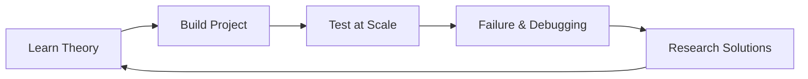

# Conclusion and Continuing Journey: The Life of a Systems Thinker

## 1. Beginner-friendly Hinglish Explanation 🇮🇳
Bhai, badhai ho! (Congratulations!). 

Aapne **Distributed Systems** ka ye lamba aur mushkil safar poora kiya hai. Aapne "Single Server" se lekar "Global AI Infrastructure" tak sab kuch seekh liya. 
Lekin yaad rakhna: **System Design** koi destination nahi hai, ye ek "Muscle" hai jo practice se badhti hai. 
Duniya badal rahi hai (Edge, Quantum, AI), aur ek achha engineer wahi hai jo hamesha "Seekhta" rehta hai. Is module mein hum aapko batayenge ki kaise is knowledge ko "Up-to-date" rakhein aur apne career ko agle level par le jayein.

---

## 2. Deep Technical Explanation
The field of distributed systems is characterized by constant evolution and the "Red Queen Hypothesis": you must run just to stay in the same place.

### The Path Forward
1. **Read Engineering Blogs**: Companies like Uber, Netflix, and Meta publish their real-world failures and successes. This is the "Bible" of system design.
2. **Build and Break**: Don't just read. Build a small system, scale it using tools like **Locust** or **JMeter**, and see where it breaks.
3. **Contribute to Open Source**: Work on projects like **Kubernetes**, **Kafka**, or **Redis** to see how the "Guts" of distributed systems are built.

---

## 3. Architecture Diagrams
**The Continuous Learning Loop:**

---

## 4. Scalability Considerations
- **Your Personal Scale**: How do you manage your own "Knowledge Base"? Use tools like **Obsidian** or **Notion** to store the patterns you learn.

---

## 5. Failure Scenarios
- **The 'Expert' Trap**: Thinking you know everything and stopping your learning. The moment you stop, your knowledge starts to "Drift" (Stale data).

---

## 6. Tradeoff Analysis
- **Specialization vs. Generalization**: Should you become a "Database Expert" or a "Cloud Generalist"? (Target: **T-shaped Skills**—know a bit of everything, but be a master of one).

---

## 7. Reliability Considerations
- **Mental Models**: Building strong mental models (like "Back-of-the-envelope math") so you can judge a new technology in 5 minutes.

---

## 8. Security Implications
- **Ethical Engineering**: Always designing for "User Privacy" and "Data Safety," not just for "Performance."

---

## 9. Cost Optimization
- **Time as a Resource**: Don't waste time on every new "Hype" technology. Focus on the "Fundamentals" (CAP Theorem, PACELC, Consistent Hashing).

---

## 10. Real-world Production Examples
- **The SRE Book (Google)**: The absolute best resource for learning how to run distributed systems in production.
- **DDIA (Designing Data-Intensive Applications)**: The "Gold Standard" book by Martin Kleppmann.

---

## 11. Debugging Strategies
- **First Principles Thinking**: When a system fails, don't just "Google the error." Think: "How is data moving? Where is the bottleneck?".

---

## 12. Performance Optimization
- **The 80/20 Rule**: 80% of your system's performance comes from 20% of the architecture decisions (like Database choice and Caching strategy).

---

## 13. Common Mistakes
- **Cargo Culting**: Copying Netflix's architecture just because "Netflix uses it," even if your app only has 100 users.
- **Ignoring the Basics**: Trying to learn "Quantum Computing" before understanding "Binary Search."

---

## 14. Final Interview Tips
1. **Be Honest**: If you don't know something, say: "I haven't used this, but based on my knowledge of X, I think Y should happen."
2. **Focus on Tradeoffs**: Never say "X is the best." Say "X is good for this, but Y is better for that."
3. **Be a Communicator**: System design is a "Collaborative" task. Show that you can work with a team.

---

## 15. Your 2026 Future
- **From Engineer to Architect**: Moving from "Writing Code" to "Designing Solutions."
- **Leading Teams**: Helping others understand the complex world of distributed systems.
- **Building the Future**: Using your skills to solve world problems like Climate Change, Healthcare, and Education through scalable tech.
	
