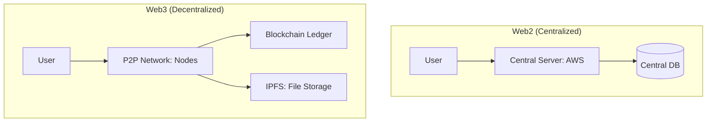

# Decentralized Web and Web3: Power to the Users

## 1. Beginner-friendly Hinglish Explanation 🇮🇳
Bhai, **Web3** ka matlab hai "Internet bina kisi Malik (Boss) ke." 

- **Web2** (Abhi wala): Amazon/Google ke paas aapka data hai. Agar wo chahein toh aapka account delete kar sakte hain. 
- **Web3**: Data "Blockchain" par hota hai. Koi ek company ise control nahi karti. 
Isme "Servers" ki jagah "Nodes" hote hain jo puri duniya mein phaile hue hain. 
- **Ownership**: Aapka username aur data aapka "Digital Property" (NFT/Wallet) hai, jise koi cheen nahi sakta. 
Ye distributed systems ka sabse "Extreme" roop hai jahan poora network hi ek database hai.

---

## 2. Deep Technical Explanation
Web3 is a vision for a decentralized internet where services are built on top of public blockchains and peer-to-peer (P2P) protocols.

### Key Technologies
1. **Blockchain (Ethereum/Solana)**: A distributed ledger where every transaction is verified by consensus.
2. **IPFS (InterPlanetary File System)**: A P2P protocol for storing files. Instead of an IP address (location), it uses a **Content Hash** (the data itself).
3. **Smart Contracts**: Self-executing code that lives on the blockchain.
4. **Wallets**: Your private key is your identity and your password.

---

## 3. Architecture Diagrams
**Web3 vs Web2 Architecture:**

---

## 4. Scalability Considerations
- **Layer 2 Solutions**: Blockchains are slow. "Layer 2" (like **Polygon** or **Optimism**) processes thousands of transactions off-chain and then "Settles" them on the main chain once an hour.
- **State Bloat**: The blockchain grows forever. How do nodes store 100TB of history? (Fix: **Data Availability Sampling**).

---

## 5. Failure Scenarios
- **Smart Contract Bug**: Once code is on the blockchain, it's "Immutable" (cannot be changed). If there's a bug, you can lose millions of dollars. (Fix: **Proxy Contracts**).
- **51% Attack**: If a group controls 51% of the nodes, they can "Rewrite" the history.

---

## 6. Tradeoff Analysis
- **Decentralization vs. Performance**: Web3 is 1000x slower and more expensive than AWS, but it's 100% "Censorship-Resistant."

---

## 7. Reliability Considerations
- **Finality**: In Web2, a database write is instant. In Web3, you have to wait for "Confirmations" (multiple blocks) to be 100% sure the data is saved.

---

## 8. Security Implications
- **Self-Custody**: If you lose your "Seed Phrase" (Private Key), you lose EVERYTHING. There is no "Forgot Password" button in Web3.

---

## 9. Cost Optimization
- **Gas Fees**: Users pay for every computation. Optimization means writing "Gas-efficient" code to save users money.

---

## 10. Real-world Production Examples
- **Uniswap**: A decentralized exchange (DEX) that does billions in volume with zero employees.
- **Brave Browser**: Uses Web3 to reward users for watching ads with BAT tokens.
- **ENS (Ethereum Name Service)**: A decentralized version of DNS (e.g., `rahul.eth`).

---

## 11. Debugging Strategies
- **Block Explorers (Etherscan)**: Watching every single transaction and its "Logs" in public.
- **Local Forking**: Creating a "Copy" of the whole blockchain on your laptop to test your code before deploying.

---

## 12. Performance Optimization
- **Indexing Services (The Graph)**: Blockchains are terrible for "Searching." The Graph builds a searchable "Sub-graph" (index) of blockchain data.

---

## 13. Common Mistakes
- **Putting Large Files on Blockchain**: Storing a 5MB photo on Ethereum would cost $10,000. (Always put metadata on BC and files on **IPFS/Arweave**).
- **Not Testing for 'Re-entrancy'**: A famous hack where an attacker calls your code again while it's still running, stealing all the money.

---

## 14. Interview Questions
1. What is the difference between Web2 and Web3 architecture?
2. How do 'Layer 2' scaling solutions work?
3. What is 'IPFS' and why is it better than S3 for decentralized apps?

---

## 15. Latest 2026 Architecture Patterns
- **ZK-Proof (Zero Knowledge)**: Proving that "I have the password" or "I am 18+ years old" without actually showing the password or birthdate.
- **DePIN (Decentralized Physical Infrastructure)**: People getting paid in tokens to share their spare Hard Drive space or WiFi with others.
- **Interoperability (Cross-chain)**: Apps that live on 5 different blockchains at once and share data seamlessly.
	
