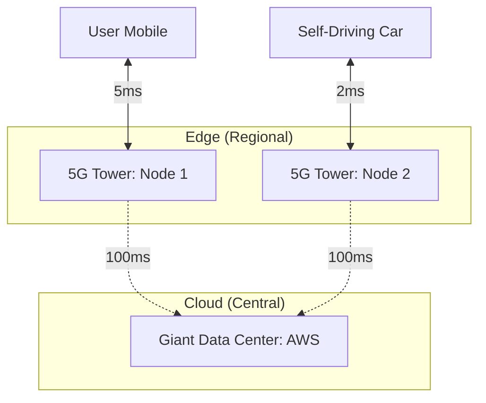

# Edge Computing and 5G: The Near-Zero Latency Future

## 1. Beginner-friendly Hinglish Explanation 🇮🇳
Bhai, **Edge Computing** ka matlab hai "Data ko user ke ghar ke paas le jana." 

Pehle kya hota tha? Aap mobile par game khel rahe ho, aapka phone request bhejta hai USA ke server ko, aur wahan se jawab aata hai. Isme time (Latency) lagta hai. 
**Edge Computing** mein, "Server" aapke shehar ke 5G tower ke andar hi hota hai! 
- **5G**: Ye sirf tez internet nahi hai, ye "Zero Delay" wala internet hai. 
- **Edge**: Isse AI, Self-driving cars, aur VR games itne fast ho jayenge ki aapko buffering ka naam-o-nishan nahi milega.

---

## 2. Deep Technical Explanation
Edge computing is a distributed computing paradigm that brings computation and data storage closer to the sources of data.

### Why Edge?
1. **Latency**: Round-trip time (RTT) drops from 100ms+ to <5ms.
2. **Bandwidth**: Instead of sending all 4K video footage to the cloud, you process it at the Edge and only send "Alerts."
3. **Privacy**: Data never leaves the local network (important for hospitals/factories).

### The Role of 5G
- **URLLC (Ultra-Reliable Low-Latency Communication)**: The part of 5G designed for mission-critical apps like remote surgery.
- **MEC (Multi-access Edge Computing)**: Running cloud-like services inside the telecommunication operator's network.

---

## 3. Architecture Diagrams
**Edge vs Cloud Architecture:**

---

## 4. Scalability Considerations
- **Extreme Sharding**: Instead of 3 regions (USA, Europe, Asia), you now have 30,000 "Mini-regions" (every 5G tower). Managing this requires **Massive Automation**.

---

## 5. Failure Scenarios
- **Edge Disconnection**: If the 5G tower's fiber is cut, the edge node must "Sync" back to the cloud once it's online.
- **Resource Exhaustion**: Edge nodes are small. If too many people connect, the node will crash. (Fix: **Overflow to Cloud**).

---

## 6. Tradeoff Analysis
- **Consistency vs. Latency**: Edge computing is the ultimate **AP (Available and Partition-Tolerant)** system. You get extreme speed but keeping 30k nodes "In Sync" (Consistency) is impossible.

---

## 7. Reliability Considerations
- **State Handover**: If a car moves from Tower A to Tower B, its "Data" must move with it in milliseconds without breaking the connection.

---

## 8. Security Implications
- **Large Attack Surface**: 30,000 edge nodes are harder to secure than 1 central data center.
- **Physical Security**: Someone could physically steal a small edge server from a tower.

---

## 9. Cost Optimization
- **Data Filtering**: Processing 1TB of CCTV footage at the edge and only sending the 1MB "Suspect Detected" clip to the cloud saves 99% on bandwidth.

---

## 10. Real-world Production Examples
- **Cloudflare Workers**: One of the most popular edge-computing platforms.
- **AWS Wavelength**: Bringing AWS services inside 5G networks (Verizon/Vodafone).
- **Tesla**: Every Tesla car is an "Edge Node" that processes sensor data locally.

---

## 11. Debugging Strategies
- **Distributed Tracing (at the Edge)**: Using specialized tools to see why a request was slow at a specific 5G tower in Mumbai.

---

## 12. Performance Optimization
- **Wasm (WebAssembly)**: Using Wasm to run code on edge nodes because it's ultra-lightweight and starts in <1ms.

---

## 13. Common Mistakes
- **Assuming Cloud Connectivity**: Designing an edge app that crashes if it can't talk to the main database in the USA. (Edge apps must be **Offline-First**).
- **Over-allocating Resources**: Trying to run a giant DB on a tiny edge node.

---

## 14. Interview Questions
1. What is 'Multi-access Edge Computing (MEC)'?
2. How does 5G enable new distributed systems patterns?
3. What are the challenges of 'Data Consistency' across 10,000 edge nodes?

---

## 15. Latest 2026 Architecture Patterns
- **AI-at-the-Edge**: Running "Inference" on the 5G tower to recognize faces or voices in <10ms.
- **Peer-to-Peer Edge**: Devices talking directly to each other (e.g., Car-to-Car) without even hitting the 5G tower.
- **Starlink Integration**: Bringing Edge Computing to the middle of the ocean/desert using satellite-based edge nodes.
	
