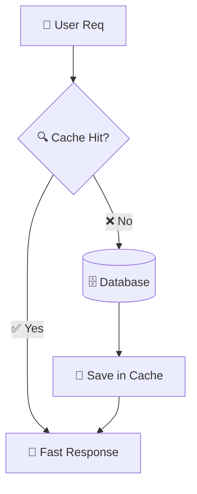

# ⚡ High Performance Caching (System Design Guide)
> **Level:** Beginner → Expert | **Goal:** Master Redis, Memcached, and Write-Back/Write-Through Policies

---

## 📋 Is Guide Se Kya Seekhoge

| Topic | Importance |
|-------|------------|
| 1. Why Cache? | Latency vs Cost |
| 2. Cache Hit & Miss | Execution Logic |
| 3. Caching Policies | Read-Through, Write-Through, Write-Back |
| 4. Eviction Algorithms | LRU, LFU, FIFO |
| 5. Redis vs Memcached | Tool selection |
| 6. Exercises & Challenges | Design a fast system |

---

## 1. 🚀 Caching: Speed ka Secrete

Caching data ko temporary **In-Memory (RAM)** store karke hard disk (DB) access bachata hai. RAM 100-1000x faster hai HDD/SSD se.

- **Latency:** DB query (50ms) -> Cache query (1ms).
- **Throughput:** Cache ek saath 100,000 queries handle kar sakta hai per second.

---

## 2. 🏗️ Cache Hit vs Cache Miss

Jab code record mangta hai:
1. **Cache Hit:** Data cache mein mil gaya. (Fast).
2. **Cache Miss:** Data cache mein nahi hai. (Database se laani hogi aur cache mein dalni hogi).

---

## 🏗️ 3. Caching Policies: Write aur Read Logic

Traffic ke hisaab se sahi policy choose karein.

- **Read-Through:** App hamesha cache se mangti hai. Cache DB se update hota hai.
- **Write-Through:** Pehle cache mein likho, phir turant DB mein likho. (Data safety, write slow).
- **Write-Back (Write-Behind):** Pehle cache mein likho, DB mein baad mein (async) aram se update karo. (Write super fast, lekin data loss risk).

---

## 🛠️ 4. Cache Eviction: Kab Purana Data Delete Karein?

Cache memory limit hoti hai. Jab full ho jaye, tab rules follow hote hain:
- **LRU (Least Recently Used):** Jo data sabse purana used hai, use delete karo. (Standard for most apps).
- **LFU (Least Frequently Used):** Jo data kam use hota hai. (Good for frequency-based context).
- **FIFO:** Jo pehle aaya, wo pehle jaye.

---

## 📊 5. Redis vs Memcached

| Feature | Redis | Memcached |
|---------|-------|-----------|
| **Data Types** | Strings, Lists, Hashes, Geospatial | Only Strings |
| **Persistence** | Snapshot (AOF/RDB) | None (In-memory only) |
| **Scaling** | Replication & Cluster | Sharding Support |
| **Complexity** | High | Simple |

---

## 🏢 6. Global CDN Caching

Sirf backend nahi, Images aur Videos ko User ke pass (City level) cache karna **CDN (Content Delivery Network)** logic hai (Cloudflare/Akamai).

---

## 🧪 Exercises — Caching Design Challenges!

### Challenge 1: The Outdated Data! ⭐⭐
**Scenario:** Aapne user profiles cache kar di. User ne city change ki, lekin app purani city dikha rahi hai 10 mins tak. 
Question: Is problem ka name kya hai aur ise kaise fix karein?

Answer**

Isse **Cache Invalidation** ya **Stale Data** problem kehte hain. Fix: Jab bhi Database update ho, us `key` ko cache se turant delete (Evict) karo (Write-through pattern).

---

## 🔗 Resources
- [Redis Documentation (Official)](https://redis.io/documentation)
- [System Design: Caching (ByteByteGo)](https://bytebytego.com/courses/system-design-interview/caching)
- [How CDN works (Cloudflare)](https://www.cloudflare.com/learning/cdn/what-is-a-cdn/)
