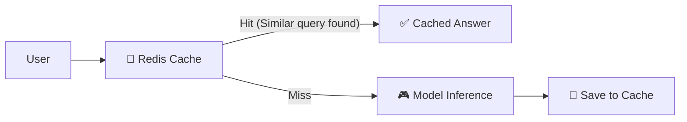

# 💰 Cost Optimization for AI System Design
> **Level:** Beginner → Expert | **Goal:** Master Token Bills, GPU Efficiency, and Cloud Saving

---

## 📋 Is Guide Se Kya Seekhoge

| Topic | Importance |
|-------|------------|
| 1. Token Economics | Bills, Limits, and Pruning |
| 2. Cloud vs On-Prem (Build vs Buy) | GPU cost trade-off |
| 3. Model Routing Logic | Smart model selection |
| 4. Semantic Caching | Save model calls via Redis |
| 5. Spot Instances (On-Demand vs Spot) | Saving up to 80% on compute |
| 6. Quantization for Cost | Memory optimization (INT4) |

---

## 1. 💵 Token Economics: AI Bills Understanding

AI models (APIs) hamesha **Tokens** (Words base unit) par charge karte hain ($ per 1M tokens).

- **Prompt Tokens:** Input data price.
- **Completion Tokens:** Model response price.
- **Context Length:** Pura document prompt mein dalna expensive ho sakta hai.

**Optimization Logic:**
- **Summarize first:** 10,000 words ko 500 words mein summarize karke phir prompt mein bhejo.

---

## 🏗️ 2. Build vs Buy (OpenSource vs API)

AI Engineer ko hamesha decide karna hota hai: **GPT-4 (Buy)** ya **Llama-3 on a GPU (Build)**?

| Factor | API (OpenAI/Anthropic) | Open Source (vLLM/Ollama) |
|--------|----------------------|-------------------------|
| **Cost** | Fixed per token | GPU rental (Hourly) |
| **Setup** | 1 Minute | 1 Hour |
| **Control** | None | Full Control |
| **Privacy** | Shared Infrastructure | Isolated VPC |
| **Scaling** | Automatic | Manual (Kubernetes) |

---

## 3. 🚀 Semantic Caching: Use Redis to Save Money

Agar 10 users "Llama-3 kya hai?" puchenge, toh aap model ko 10 bar mat bulao.



**Savings:** Redis cost ~0.001$, Model cost ~0.10$. Savings = 99%.

---

## 4. ⚖️ Smart Model Routing

Har simple query ke liye GPT-4 (Costly) use karna wastage hai.

```python
def expensive_checker(query):
    # Simple logic word count and complexity check
    if "code" in query or "math" in query:
        return "gpt-4"
    else:
        return "gpt-3.5-turbo" # Much cheaper
```

---

## 5. 📉 GPU Cost: Spot Instances Logic

AWS (Azure/GCP) mein 2 tarah ki machine pricing hoti hai:
- **On-Demand:** Machine hamesha aapki hai (Costly).
- **Spot Instances:** Faltu bachi hui machines (70% - 90% discount).

**Best Strategy:** Training aur batch processing ke liye **Spot Instances** use karein. Production (Live API) ke liye Reserved ya On-Demand.

---

## 6. 📉 Memory Optimization for Scale

Inference server par memory (VRAM) bachaoge toh machine sasti padegi.
- **Quantization (4-bit/8-bit):** Model size 50% - 75% kam ho jata hai accuracy mein minimal drop ke saath.
- **LoRA Adapters:** Ek hi base model ke saath multiple fine-tuned versions chalana.

---

## 🧪 Exercises — Budgeting Challenge!

### Challenge 1: Budget the project ⭐⭐⭐
**Scenario:** Aapko 1000 users ke liye AI assistant chalana hai. Har user din mein 20 queries bhejta hai (Avg 500 tokens). 
Total Tokens = 1000 * 20 * 500 = 10,000,000 (10M) tokens.
Question: Agar GPT-4 $10/M tokens aur GPT-3.5 $0.5/M tokens charge karta hai, toh Monthly cost kitni hogi? 
<details><summary>Answer</summary>
GPT-4 Cost = 10M * 10 = **$100 / day** ($3000 / mo).
GPT-3.5 Cost = 10M * 0.5 = **$5 / day** ($150 / mo).
Solution: Logic routing lagao taki 90% queries GPT-3.5 pe jayein!
</details>

---

## 🔗 Resources
- [Full OpenAI Pricing Guide](https://openai.com/pricing)
- [How to reduce LLM costs (Article)](https://www.anyscale.com/blog/how-to-reduce-llm-costs-by-90-percent)
- [Llama-3 Benchmark Costs (vLLM)](https://vllm.ai/stats)
