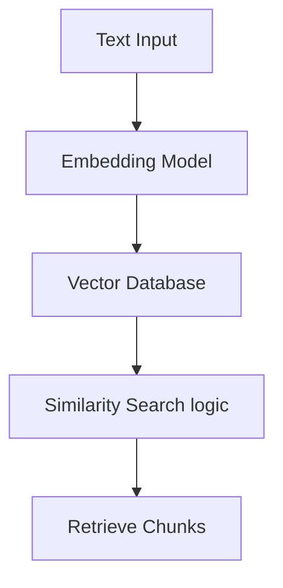

# 🗄️ Database Design for AI (System Design Guide)
> **Level:** Beginner → Expert | **Goal:** Master Choice of Databases for RAG, User Data, and Caching

---

## 📋 Is Guide Se Kya Seekhoge

| Topic | Importance |
|-------|------------|
| 1. SQL vs NoSQL in AI | Structured vs Semi-structured data |
| 2. Vector Databases (Deep Dive) | RAG architecture basis |
| 3. Key-Value Stores (Redis) | Caching and session persistence |
| 4. Document Stores (MongoDB) | Storing flexible LLM traces |
| 5. Database Partitioning | Scalability logic |
| 6. Exercises & Challenges | Real-world DB design |

---

## 1. 🏗️ Database Choice: AI App ke 3 Components

AI application mein humein hamesha 3 alag tarah ke storage chahiye hote hain.

1. **User Management & Metadata:** Accounts, Plans, History (Use **SQL - PostgreSQL/MySQL**).
2. **Context & Semantic Knowledge:** PDF Chunks, Vector Embeddings (Use **Vector DB - ChromaDB/Pinecone/Milvus**).
3. **Speed & Session Memory:** User current convo context, fast lookups (Use **In-Memory - Redis**).

---

## 2. 🧠 Vector Databases Internals

Vector databases "Numbers" (Embeddings) store karte hain. Inka index structure alag hota hai normal B-Tree indexes se.

- **HNSW (Hierarchical Navigable Small Worlds):** Sabse fast search graph based performance.
- **IndexIVF:** Inverted File logic clustering ke liye.



---

## 3. ⚡ Cache Mastery with Redis

AI applications mein **Cost** aur **Latency** bachane ke liye "Same question, No model call" logic chalta hai.

1. **Semantic Caching:** Agar naya question purane question se 95% milta hai, toh model ko mat call karo.
2. **Conversation Persistence:** User ki chat history Redis mein rakho taki prompt size maintain rahe.

```python
import redis

r = redis.Redis(host='localhost', port=6379, db=0)

def get_cached_response(query_hash):
    cached = r.get(query_hash)
    if cached:
        return cached.decode('utf-8')
    return None
```

---

## 4. 📂 Flexible Logging with MongoDB

LLM outputs (tracers) hamesha different format mein hote hain. Structured (SQL) mein dalna mushkil hota hai. Hum **Document Stores (NoSQL)** use karte hain "Audit Logs" save karne ke liye.

```json
{
  "user_id": "u123",
  "request": "Tell me a joke",
  "response": "...",
  "tokens": 150,
  "metadata": { "model": "gpt-4", "region": "us-east-1" }
}
```

---

## 5. 🛠️ Scalability Logic: Sharding & Replication

- **Read Replicas:** Jab 1 million users questions puch rahe hain, toh database load badh jata hai. Hum 1 "Master" (Write) aur multiple "Slaves" (Read) rakhte hain.
- **Partitioning:** Data ko year-wise ya user-region wise alag databases mein divide karna.

---

## 🧪 Exercises — Design Challenges!

### Challenge 1: Custom RAG Architecture ⭐⭐
**Scenario:** Ek AI system design karo jise 10 million documents handle karne hain. 
Question: Aap ek hi database use karenge ya dedicated Vector DB? kyu?
<details><summary>Answer</summary>
Dedicated Vector DB (like Milvus/Pinecone) zaroori hai. SQL databases millions of 1536-dim vectors search karne mein itne fast nahi hote aur latency users ko feel hogi.
</details>

---

## 🔗 Resources
- [DB Engines Comparison](https://db-engines.com/en/ranking)
- [PostgreSQL PGVector Extension](https://github.com/pgvector/pgvector)
- [Redis for AI Cache](https://redis.com/solutions/ai/)
