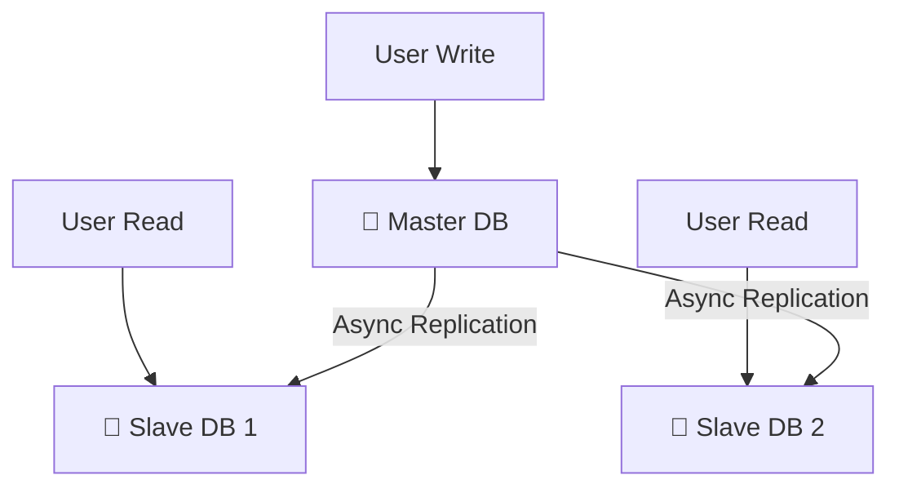

# 🗄️ Database Scaling & High Capacity (System Design Guide)
> **Level:** Beginner → Expert | **Goal:** Master Sharding, Replication, Normalization, and Denormalization

---

## 📋 Is Guide Se Kya Seekhoge

| Topic | Importance |
|-------|------------|
| 1. Vertical vs Horizontal Scaling | Server sizing vs Clusters |
| 2. Replication (Read vs Write) | Handling large traffic |
| 3. Sharding (Partitioning) | Database splitting |
| 4. Normalization vs Denormalization | Performance trade-offs |
| 5. Indexes (B-Tree vs Hash) | Search speed-up |
| 6. Exercises & Challenges | Design a high-capacity DB |

---

## 1. 🏗️ Scaling Databases: The Two Ways

1. **Vertical Scaling (Scaling UP):** Bigger CPU, more RAM. (Limit hai, expensive hai).
2. **Horizontal Scaling (Scaling OUT):** More machines (Clusters). (Best for millions of users).

---

## 2. 👥 Database Replication: Master-Slave Architecture

Jab 1,000,000 log ek saath profiles dekh rahe hain, toh database hang ho sakta hai.

- **Master (Write):** Saare update, insert, delete operations yahan honge.
- **Slaves (Read):** Master se data automatic sync hota hai. Saare Select (Read) queries yahan honge.

---

## 🧩 3. Sharding: Splitting Data

Jab database ek machine (Slave/Master) mein fit na ho, toh data ko split karte hain.

- **Range Sharding:** A-M (Server 1), N-Z (Server 2).
- **ID Sharding (Modular):** `ID % 3 == 0` (Server 1), `ID % 3 == 1` (Server 2).

**Downside:** Jo queries multi-shard (joins) honge, wo super slow ho jayenge.

---

## 🏗️ 4. Normalization vs Denormalization

- **Normalization (SQL Standard):** Data ko small tables mein divide karna duplicates bachane ke liye (3NF). (Good for data integrity, Slow for complex joins).
- **Denormalization (NoSQL Style):** Redundant data rakhna tables mein joins kam karne ke liye. (Good for Read performance).

---

## 🚀 5. Mastering Indexes

Database mein data dhundne ke liye index zaroori hai.

- **B-Tree Index:** Range queries (`where age > 20`) ke liye best.
- **Hash Index:** Exact match (`where id = 101`) ke liye fastest (`O(1)`).

**Caution:** Har table pe 10 indexes lagana write performance ko 5x slow kar deta hai. Sirf zaroori columns pe index lagayein.

---

## 🧪 Exercises — Database Scaling Challenges!

### Challenge 1: The Join Nightmare! ⭐⭐
**Scenario:** Aapne tables ko normalise kar diya (10 tables). Ab ek profile page load karne ke liye 8 joins lag rahe hain. 
Question: System design fix kya hoga kyu?

Answer

**Denormalization** ya **Caching**. Profile data ko ek JSON document (MongoDB) mein store karein ya Redis mein pre-computed view (Cache) rakhein join overhead bachane ke liye.

---

## 🔗 Resources
- [Database Sharding (DigitalOcean Guide)](https://www.digitalocean.com/community/tutorials/understanding-database-sharding)
- [PostgreSQL Indexing (Official)](https://www.postgresql.org/docs/current/indexes.html)
- [DynamoDBScaling (AWS Whitepaper)](https://docs.aws.amazon.com/amazondynamodb/latest/developerguide/HowItWorks.Partitions.html)
