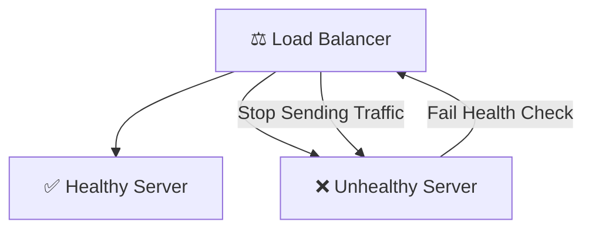

# ⚡ Advanced Load Balancing (System Design Guide)
> **Level:** Beginner → Expert | **Goal:** Master Traffic Distribution for High-Scale Apps

---

## 📋 Is Guide Se Kya Seekhoge

| Topic | Importance |
|-------|------------|
| 1. Layer 4 vs Layer 7 | Transport vs Application |
| 2. Algorithms Deep Dive | Round Robin to Least Conns |
| 3. Health Checks | Detecting failures |
| 4. SSL Termination | Security at the edge |
| 5. Sticky Sessions (Session Affinity) | Persistent connections |
| 6. Global Server Load Balancing (GSLB) | Multi-region scaling |

---

## 1. 🏗️ Level 4 vs Level 7 Load Balancing

Load balance dono networking layers pe ho sakta hai. Production apps mein choice impact karti hai latency aur logic ko.

- **Layer 4 (L4):** Transport layer (IP + Port) par kaam karta hai. Ye fast hai kyu ki ye data (HTTP body/headers) nahi padhta.
- **Layer 7 (L7):** Application layer (HTTP Headers, URLs, Cookies) par kaam karta hai. Ye decision le sakta hai URL pattern dekhkar (e.g. `/api` goes to Server A, `/docs` goes to Server B).

| Feature | L4 Load Balancing | L7 Load Balancing |
|---------|--------------------|--------------------|
| **Data Scope** | IP & Port | HTTP/HTTPS Data |
| **Speed** | Extremely Fast | Fast |
| **Logic** | Simple (Round Robin) | Complex (Rules, Path) |
| **Use Case** | TCP/UDP Traffic | Web Applications |

---

## ⚖️ 2. Load Balancing Algorithms

Traffic ko kaise divide karna hai, ye algorithm decide karta hai.

1. **Round Robin:** Line se har server ko ek-ek request bhejo. (Best for same capacity servers).
2. **Least Connections:** Jis server pe active connections kam hain, wahan traffic bhejo. (Best for long-running tasks).
3. **IP Hash:** User ki IP se server decide karo. (Best for "Sticky sessions" - ek hi user ek hi server pe jaye).
4. **Weighted Round Robin:** Powerful servers ko zyada traffic do.

---

## 🚨 3. Health Checks & Auto-Healing

Load balancer tabhi "Load" balance kar sakta hai agar servers "Zinda" (Healthy) hon.

- **TCP Check:** Kya port 80/443 open hai?
- **HTTP Check:** Kya `/health` endpoint `200 OK` return kar raha hai?

---

## 🔒 4. SSL Termination (SSL Offloading)

SSL Encryption (HTTPS) compute intensive hai. Load Balancer level pe SSL certificate "Terminate" karne se backend servers ka load kam ho jata hai. Backend aur Load Balancer ke beech "Plainttext HTTP" (over internal VPC network) faster chalta hai.

---

## 🌍 5. GSLB: Global Scaling

Jab aapki app poori duniya mein use ho rahi hai, toh India ke user ko India ke server (Local region) pe bhejna zaroori hai. **GSLB (Global Server Load Balancing)** DNS-based intelligence use karta hai traffic route karne ke liye nearest data center tak.

---

## 🧪 Exercises — Load Balancing Design!

### Challenge 1: Choose the Algorithm! ⭐⭐
**Scenario:** Aap ek Real-time Chat application design kar rahe hain jahan WebSocket connection open rehta hai 30 mins tak. 
Question: Aap "Round Robin" use karenge ya "Least Connections"?

Answer

**Least Connections**! Round Robin se ho sakta hai ek server pe saare heavy connections chale jayen aur dusra server khali rahe. Least connections ensure karega load balance rahe session duration ke basis pe.

---

## 🔗 Resources
- [Nginx Load Balancing Official](https://docs.nginx.com/nginx/admin-guide/load-balancer/http-load-balancer/)
- [AWS Elastic Load Balancing (ELB)](https://aws.amazon.com/elasticloadbalancing/)
- [Cloudflare GSLB Guide](https://www.cloudflare.com/learning/performance/what-is-global-server-load-balancing/)
