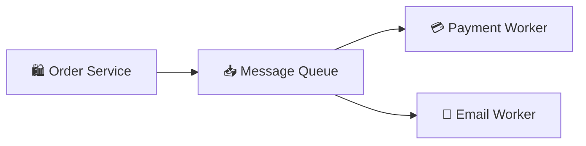

# 📬 Message Queues & Event-Driven (System Design Guide)
> **Level:** Beginner → Expert | **Goal:** Master RabbitMQ, Kafka, Pub/Sub, and Decoupling Architectures

---

## 📋 Is Guide Se Kya Seekhoge

| Topic | Importance |
|-------|------------|
| 1. Synchronous vs Asynchronous | Immediate vs Deferred response |
| 2. Message Queues (MQ) | RabbitMQ, Redis Pub/Sub |
| 3. Event Streaming (Kafka) | High scale data pipelines |
| 4. Pub/Sub Model | Publishers & Subscribers |
| 5. Idempotency logic | Handling duplicate messages |
| 6. Exercises & Challenges | Design a distributed system |

---

## 1. 🏗️ Synchronous vs Asynchronous

- **Synchronous (Request-Response):** User wait karta hai result tak (e.g. Chat reply). (Fast but blocks connection).
- **Asynchronous (Event-based):** User ko response mila "Accepted", kaam background mein hota hai (e.g. PDF processing, Email notification). (Slow tasks, scalable).

---

## 🏗️ 2. Message Queues (MQ): The Buffer

Message queues do services (components) ko decouple karti hain.

- **RabbitMQ:** Powerful, complex routing support. (Good for direct task distribution).
- **Redis (Streams/Queue):** Simple, ultra-fast. (Good for lightweight async jobs).



---

## 🚀 3. Event Streaming (Kafka): The Heavyweight

Jab millions of events (Log tracking, Stock prices) handle karne hon, toh hum **Apache Kafka** use karte hain. 

- **Topic:** Categories of messages.
- **Partition:** Parallel processing scalability.
- **Consumer Group:** Multiple workers ek hi topic read karke traffic share karte hain.

---

## 🎯 4. Pub/Sub (Publisher-Subscriber) Model

Jab ek hi event multiple services ko chahiye (e.g. User signed up), toh Producer message ek **Topic** pe "Publish" karta hai, aur sab subscribed services (Email, CRM, Analytics) use "Consume" karte hain asynchronously.

---

## 🛠️ 5. Idempotency: Handling Duplicates

Agat network failure hone par same message do bar bhej diya jaye, toh consumer ko use ignore karna chahiye.
**Example:** Payment request `ID: 101` (Agar do bar aaye, toh check karo kya transaction pehle hi ho gaya?).

```python
def process_message(msg):
    if db.check_if_processed(msg.id):
        return # Duplicate, skip logic
    db.save_processed(msg.id)
    # Perform actual job
```

---

## 🧪 Exercises — Event Design Challenges!

### Challenge 1: The Bottleneck! ⭐⭐
**Scenario:** Aapki `Email Service` slow hai aur queue mein 10,000 emails pending hain. 
Question: Aap queue size badhayenge ya consumers (Workers) badhayenge? 
<details><summary>Answer</summary>
**Consumers!** Queue sirf memory buffer hai. Email processed karne ke liye zyada power (Workers) chahiye (Horizontal scaling of consumers).
</details>

---

## 🔗 Resources
- [RabbitMQ Official Tutorials](https://www.rabbitmq.com/getstarted.html)
- [Kafka Fundamentals (Confluent)](https://developer.confluent.io/learn-kafka/)
- [Pub/Sub vs Message Queues Explained](https://cloud.google.com/pubsub/docs/overview)
