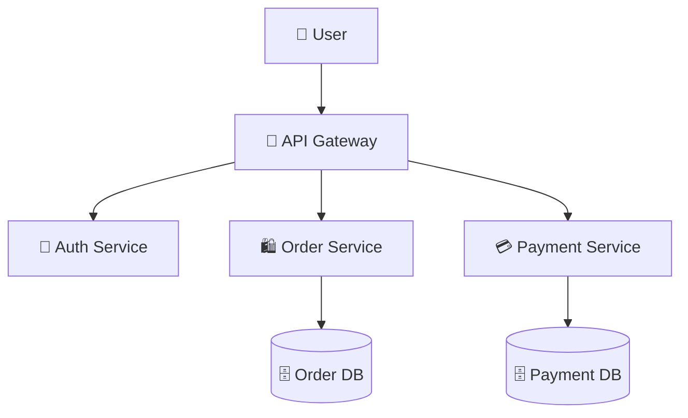
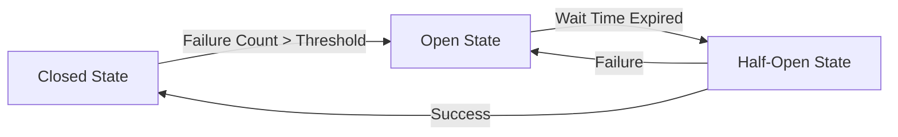

# 📦 Microservices vs Monolith (System Design Guide)
> **Level:** Beginner → Expert | **Goal:** Master Decentralized Application Architectures

---

## 📋 Is Guide Se Kya Seekhoge

| Topic | Importance |
|-------|------------|
| 1. Monolith Foundations | Tight coupling logic |
| 2. Microservices Components | API Gateways, Service Discovery |
| 3. Inter-service Communication | REST, gRPC, Message Queues |
| 4. Database Per Service | Independent storage patterns |
| 5. Circuit Breaker Pattern | Handling Cascading Failures |
| 6. Exercises & Challenges | Design a scalable platform |

---

## 1. 🏗️ Monolith: The Single Unit

Monolith application ek hi codebase aur ek hi database use karti hai. 

- **Pros:** Deployment simple hai, debugging easy hai, internal calls super fast hain.
- **Cons:** Scaling mushkil hai. Ek component (e.g. Video processing) down hai, toh poori app down.

---

## 2. 🧩 Microservices: The Decentralized Power

Badi apps (Amazon, Netflix) Microservices use karti hain. Har team apna "Service" manage karti hai.

- **Frontend Service:** UI handle karna.
- **Auth Service:** Login/JWT tokens.
- **Order Service:** E-commerce orders.
- **Payment Service:** Payment gateway integration.

---

## 3. 🚦 API Gateway & Service Discovery

Jab 100 microservices hon, toh frontend ko sabka IP yaad nahi rakhna chahiye.

1. **API Gateway:** User se request leta hai aur sahi service tak "Route" karta hai. (Rate limiting, SSL Termination, Auth check).
2. **Service Discovery (Eureka/Consul):** Jab naya service instance start hota hai, wo apna IP register karta hai central system mein.

---

## 4. 📞 Inter-Service Communication

Services aapas mein baat kaise karti hain?

- **Synchronous (REST/gRPC):** Wait karna padta hai response ke liye.
- **Asynchronous (RabbitMQ/Kafka):** Message bhej kar bhool jao, service jab free hogi tab job complete karegi (Decoupling).

---

## 🛡️ 5. Circuit Breaker: Preventing Downfall

Agar `Payment Service` down hai aur `Order Service` request bhejti rahe, toh order service bhi hang (wait) ho jayegi. Isse **Cascading Failure** kehte hain.

**Circuit Breaker (Resilience4j/Hystrix)** solution hai:
- **Closed:** Everything is normal.
- **Open:** Service down hai, requests block kar do (Show error immediately).
- **Half-Open:** Check karo kya service wapis aa gayi?

---

## 🧪 Exercises — Scalability Challenges!

### Challenge 1: The Shared DB Trap! ⭐⭐
**Scenario:** Aapne Microservices banayi hain, lekin sab ek hi SQL Database use kar rahe hain. 
Question: Isme "Scaling" problem kyu aayegi?

Answer

Sab services ek hi **DB locking** aur **IO limits** ke liye fight karenge. Database single point of failure (SPOF) ban jayega. Har service ka apna independent database hona chahiye ("Database per Service" pattern).

---

## 🔗 Resources
- [Microservices.io Patterns Guide](https://microservices.io/patterns/index.html)
- [Martin Fowler - Microservices Intro](https://martinfowler.com/articles/microservices.html)
- [Distributed Tracing (Zipkin/Jaeger)](https://www.jaegertracing.io/)
