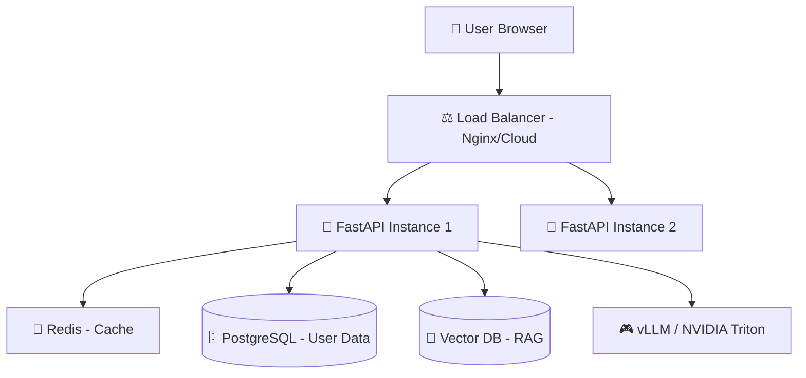

# 🏗️ Scalable AI System Design (Hinglish Guide)
> **Level:** Beginner → Expert | **Goal:** Master Production AI Architectures

---

## 📋 Is Guide Se Kya Seekhoge

| Topic | Importance |
|-------|------------|
| 1. High-Level Architecture | System logic flow |
| 2. Load Balancing (L7) | vLLM/API requests management |
| 3. Microservices vs Monolith | Modularizing AI services |
| 4. Distributed Systems | Scalability logic |
| 5. Cost-Efficient Serving | Smart routing |
| 6. Exercises & Challenges | Design a real-world system |

---

## 1. 🌍 AI System Design ka "Big Picture"

Ek production AI application sirf ek model nahi hota, balki ek poora ecosystem hota hai. Is system mein frontend, backend, database aur specialized inference engines (vLLM/Ollama) hote hain.



---

## 2. ⚖️ Load Balancing AI Requests

AI requests "Heavy" hoti hain. Normal HTTP requests 10ms leti hain, lekin AI generation 5-30 seconds le sakta hai. Iske liye normal round-robin load balancing fail ho sakti hai.

- **Least Connections:** Jis bhi server pe sabse kam active requests hain, wahan traffic bhejo.
- **Sticky Sessions:** User ka connection hamesha usi server pe rahe (Memory persistent rahe).

```nginx
# Nginx basic config for AI
upstream ai_servers {
    least_conn; # Best for AI workloads
    server 10.0.0.1:8000;
    server 10.0.0.2:8000;
}
```

---

## 🏗️ 3. Microservices Approach for AI

AI apps mein task ko split karna zaroori hai kyu ki model loading time jyada hota hai.

1. **Preprocessing Service:** Text clean karna, token count check karna.
2. **Inference Service:** Actual GPU compute (Model generation).
3. **Postprocessing Service:** Toxicity check, formatting, output sanitization.

**Advantage:** Agar postprocessing service down hai, toh pura model inference restart nahi karna padega.

---

## 4. 🚀 Queueing Systems (RabbitMQ / Redis)

Jab bade tasks hon (e.g. 50 page ki PDF analyze karna), toh user ko 2 minute tak request wait nahi karwani chahiye. Hum **Task Queues** use karte hain.


---

## 5. 💰 Cost Optimization: Routing Logic

Production mein token cost bachana sabse bada challenge hai. Hum **Model Routing** use karte hain.

- **Fast & Cheap (GPT-3.5/Llama-3-8B):** Simple questions ke liye.
- **Strong & Costly (GPT-4o/Llama-3-70B):** Complex logic ya math ke liye.

```python
def route_query(query):
    if len(query) < 50: # Simple query
        return " llama-3-8b"
    else: # Heavy query
        return "llama-3-70b"
```

---

## 🧪 Exercises — Design Challenges!

### Challenge 1: Flash Sale Simulation ⭐⭐
**Scenario:** Aap ek AI chatbot launch kar rahe hain. Expectation hai ki sudden 10,000 users per second aayenge. 
**Logic build karo:** Aap CPU scaling use karenge ya GPU scaling? Kaise manage karenge?
<details><summary>Answer</summary>
GPU scaling (vLLM replicas) zaroori hai, lekin response time limit karne ke liye hum **Rate Limiting** aur **Request Queuing** lagayenge taki GPU crash na ho.
</details>

---

## 🔗 Resources
- [System Design Primer (GitHub)](https://github.com/donnemartin/system-design-primer)
- [How Discord Scaled AI](https://discord.com/blog/how-discord-built-an-ai-infrastructure)
